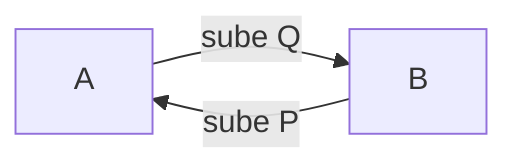

> Cantidad de bienes o servicios que los consumidores están dispuestos y pueden comprar a diferentes precios durante un período de tiempo específico

- La demanda de mercado es la suma de demandas individuales
- La demanda relaciona precio y cantidad demandada

$Q:$ cantidad
$P:$ precio
$Q = f(P):$ curva de demanda **directa** (horizontal)
$P = f(Q):$ curva de demanda **inversa** (vertical)

# Curva de Demanda
- La demanda se representa gráficamente en una curva de demanda.
>  La curva de demanda muestra la cantidad que un individuo o mercado estaría dispuesto a comprar para cada nivel de precios

![[Pasted image 20230815115053.png]]
- Aumenta la cantidad demandada o desiminuye la cantidad demandada.

![[Pasted image 20230815115238.png]]
- Si cayo el ingreso, lo que cae es la demanda (la función entera).
- El cambio en realidad no es paralelo pues la pendiente cambia.
	- $Q_D = 100 -4P \Rightarrow m = \frac{100}{4}$
	- $Q_D'=  Q_D \cdot 1.5 = 150 -6P \Rightarrow m = \frac{150}{6}$

### Función de demanda

$$
Q_D = f(\overbrace{P^{-}, P_S^{+}, P_C^{-}, I^{+}, T^{-}, \pi^{-/+},}^{poder~adquisitivo} C^{+}, i^{-}, W^{+}, A^{-}, TC^{-/+}, calidad^{-/+}, modas^{+}, gustos^{+}, edad^{-/+}, sexo^{?}, tiempo^{?}, status^{?}, expectativas^{?}, seguridad^{-/+}, marco~socio-político, \ldots)
$$
- El sup-signo indica si aumenta o decrementa la demanda.
- $P$ precio
- $P_S$ precios suplementario
- $P_C$ precio complementario
- $I$ ingresos
- $T$ taxes
- $\pi$ inflación
- $C$ crédito
- $i$ intereses
- $W$ wealth
- $A$ ahorro
- $TC$ tipo de cambio
- $calidad$
- $modas$ que es de interés popular
- $gustos$
- $edad$
- $sexo$
- $tiempo$
- $status$
- $expectativas$
- $seguridad$
- $marco~socio-político$

### Curva directa
$$Q_{D_{A}} = f (P_A)$$
- $P_A$ precio de un producto A
- *CAETERIS PARIBUS* ~ simplificación 
## Leyes de demanda
1. si aumenta $P_A \Rightarrow$ cae $Q_{D_A}$
2. baja $P_A \Rightarrow$ aumenta $Q_{D_A}$

### Violaciones

1. si aumenta $P_A \Rightarrow$ aumenta $Q_{D_A}$
	1. Inflación
	2. Espectativas del posible valor real
	3. Status / Ostentación
	4. Esnobismo
2. baja $P_A \Rightarrow$ cae $Q_{D_A}$

## Determinantes de la demanda
#### Bienes normales
> La relación entre ingreso y demanda es directa: un aumento del ingreso genera un aumento de la demanda de dichos bienes.

#### Bienes inferiores
> La relación entre ingreso y demanda es inversa: un aumento del ingreso genera una disminución de la demanda de dichos bienes.

#ParcialEco :  ejemplo: Comes carnes buenas a diferencia de carnes malas.
#### Bienes complementarios
> La relación entre la demanda del bien X y el precio de un complementario Cx es directa $\Rightarrow$ si aumenta el precio de Cx, v.g., por menor oferta de Cx, se reduce la cantidad demandada de Cx y por lo tanto se reduce la demanda de X.

![[Pasted image 20230815121830.png]]
- Cuando en un bien complementario, baja la cantidad, entonces sube el precio (gráfico de la derecha). Entonces cae la demanda del producto X ([[#Leyes de demanda]]). 

#### Bienes sustitutos
> Bienes sustitutos: La relación entre la demanda del bien X y el precio de un sustituto Sx es inversa. $\Rightarrow$  si aumenta el precio de Sx, se reduce la cantidad demandada de Sx y por lo tanto aumenta la demanda de X.

![[Pasted image 20230815121951.png]]
- Aumenta el precio del producto sustituto, esto implica que se desplaza la demanda hacia la derecha del producto X. Aumenta la demanda pues los demandantes del otro producto bajo.

# Demanda del mercado
$Q_{D_A} = 80-2P_A \Rightarrow P_A = 40 -\frac{1}{2}Q_{D_A}$
$Q_{D_B} = 60-2P_B \Rightarrow P_B = 60 -Q_{D_B}$

$Q_{D_A} +Q_{D_B} = curva~de~demanda~del~mercado$

$$
\begin{cases}
P \geq 60 && Q_D = 0\\
40 \lt P \lt 60 && Q_D = 60- P\\
P \leq 40 && Q_D = 140-3P 
\end{cases}
$$
Sobre un mismo producto. Ejemplo.
![[Pasted image 20230815123855.png]]

# Excedente del Consumidor
> Los puntos de la curva de demanda muestran la valoración máxima que el consumidor da a cada cantidad de bien

> El excedente del consumidor representa la diferencia entre lo que un consumidor está dispuesto a pagar por un producto y lo que realmente paga por él. En otras palabras, es la ganancia neta que un consumidor obtiene al comprar un producto a un precio inferior al máximo que estaría dispuesto a pagar.

- El precio de mercado se determina por el cruce entre la oferta y la demanda, y representa la valoración del bien por parte del consumidor marginal.
- La diferencia entre la curva de demanda y el precio es el excedente del consumidor → el valor adicional que los consumidores estarían dispuestos a pagar por el bien, pero que como no deben pagarlo lo ganan.
![[Pasted image 20230815131759.png]]

#### Ejemplo
- Si un consumidor está dispuesto a pagar $50 por un artículo pero solo paga $30 por él, su excedente del consumidor sería $20 ($50 - $30).
- El excedente del consumidor refleja el beneficio adicional que un consumidor obtiene al obtener un producto a un precio más bajo de lo que estaría dispuesto a pagar.