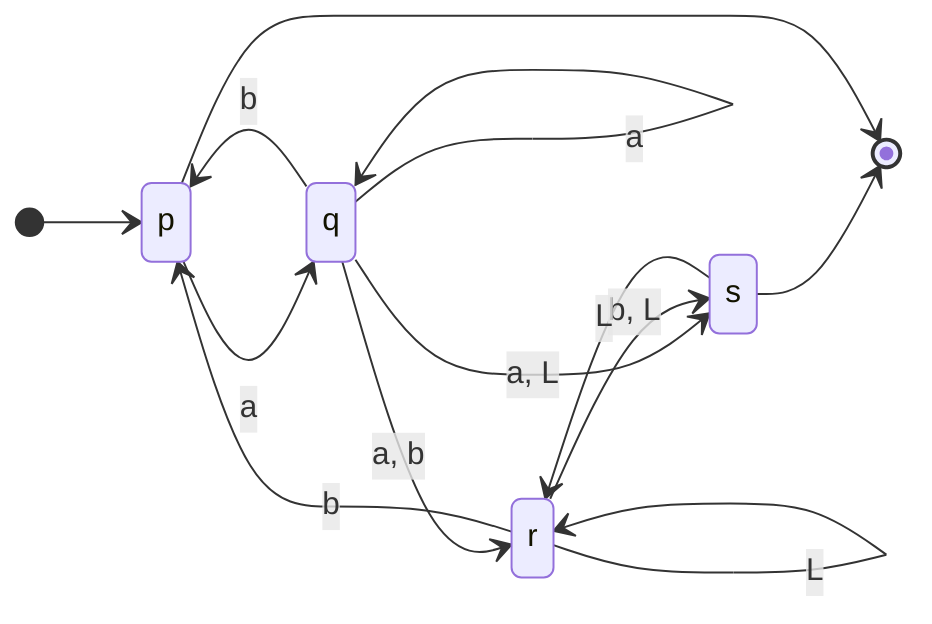

> Cuando consumo lambda, no consumo de la entrada, esto significa que cuando tengo un transición $\lambda$ es como skipear y pasas al siguiente estado con el mismo input de entrada

$$
[p, aba] \mapsto [q , ba] \mapsto
\begin{cases}
[r, a] \mapsto NO~PUEDO\\
[s, ba] \mapsto [r, ba] \mapsto [p, a] \mapsto [q,\lambda] \mapsto [s, \lambda]
\end{cases}
$$
# Función de transición
> En los ADND-lambda la función de transicipin se define $\lambda: Q \times \Sigma \cup \{\lambda\} \rightarrow P(Q)$ donde P(Q) denota todos los subconjuntos de Q y se pueden tener transiciones donde no se consume ningun simbolo de entrada.
# Clausura ()
> Es a todos los estados a los que podés llegar desde un estado aplicando $\lambda$.