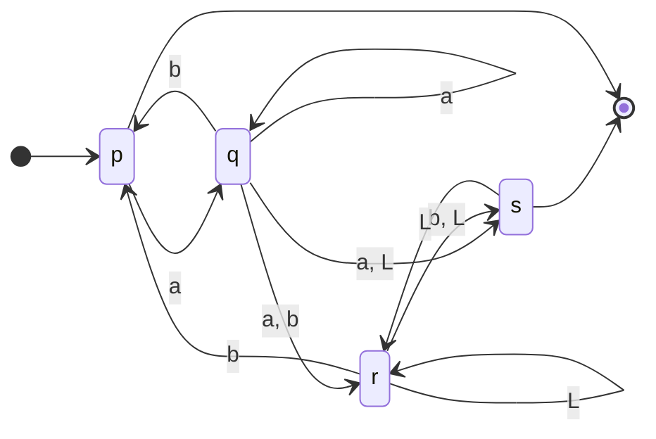
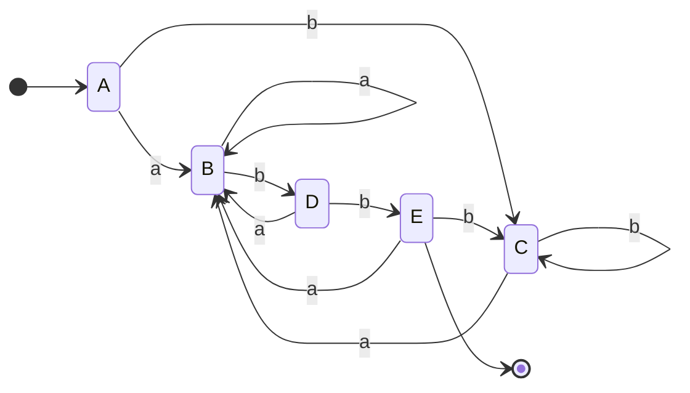

> Cuando consumo lambda, no consumo de la entrada, esto significa que cuando tengo un transición $\lambda$ es como skipear y pasas al siguiente estado con el mismo input de entrada

$$
[p, aba] \mapsto [q , ba] \mapsto
\begin{cases}
[r, a] \mapsto NO~PUEDO\\
[s, ba] \mapsto [r, ba] \mapsto [p, a] \mapsto [q,\lambda] \mapsto [s, \lambda]
\end{cases}
$$
# Función de transición
> En los ADND-lambda la función de transicipin se define $\lambda: Q \times \Sigma \cup \{\lambda\} \rightarrow P(Q)$ donde P(Q) denota todos los subconjuntos de Q y se pueden tener transiciones donde no se consume ningun simbolo de entrada.
# Clausura ()
> Es a todos los estados a los que podés llegar desde un estado aplicando $\lambda$.

# AFND-$\lambda \rightarrow$ AFD
[video epico](https://www.youtube.com/watch?v=km-yS9BUDFA&ab_channel=MauricioQuirogaLipe)

Pasos a seguir
1. Clausura de todos los estados
2. Tabla de transiciones de AFND-$\lambda$
3. Tabla de transiciones sin $\lambda$
4. Tabla de transiciones del AFD

![[Pasted image 20230817102256.png]]

$$
CLAUSURAS
\begin{cases}
clausura(0) = \{0, 1, 2, 4, 7\}\\
clausura(1) = \{1, 2, 4\}\\
clausura(2) = \{2\}\\
clausura(3) = \{3, 6, 1, 2, 4, 7\}\\
clausura(4) = \{4\}\\
clausura(5) = \{5, 6, 1, 2, 4, 7\}\\
clausura(6) = \{6, 1, 2, 4, 7\}\\
clausura(7) = \{ 7\}\\
clausura(8) = \{ 8\}\\
clausura(9) = \{ 9\}\\
clausura(10) = \{ 10\}
\end{cases}\tag{1}
$$

1. Tabla AFND-L

| $\delta$ |  $\lambda$ |  $a$ |  $b$ |  
| -- | -- | -- | -- |
| $\rightarrow 0$ | $\{1, 7\}$ | $\varnothing$ | $\varnothing$ |
| $1$ | $\{2, 4\}$ | $\varnothing$ | $\varnothing$ |
| $2$ | $\varnothing$ | $\{3\}$ | $\varnothing$ |
| $3$ | $\{6\}$ | $\varnothing$ | $\varnothing$ |
| $4$ | $\varnothing$ | $\varnothing$ | $\{5\}$ |
| $5$ | $\{6\}$ | $\varnothing$ | $\varnothing$ |
| $6$ | $\{1, 7\}$ | $\varnothing$ | $\varnothing$ |
| $7$ | $\varnothing$ | $\{8\}$ | $\varnothing$ |
| $8$ | $\varnothing$ | $\varnothing$ | $\{9\}$ |
| $9$ | $\varnothing$ | $\varnothing$ | $\{10\}$ |
| $*10$ | $\varnothing$ | $\varnothing$ | $\varnothing$ |

1. Tabla de transición sin $\lambda$

![[Pasted image 20230817112041.png]]

| $\delta$ | $a$ | $b$ |
| -- | -- | -- |
|$\rightarrow clausura(0) :A$ | $\{3, 8\}\cup \{1, 2, 4, 6, 7\} : B$ | $\{5\} \cup \{1, 2, 4, 6, 7\} : C$ | 
|$\{3, 8\}\cup \{1, 2, 4, 6, 7\}: B$ | $\{3, 8\}\cup \{1, 2, 4, 6, 7\} :B$ | $\{5, 9\} \cup \{1, 2, 4, 6, 7\} :D$ | 
| $\{5\} \cup \{1, 2, 4, 6, 7\} :C$ |$\{3, 8\}\cup \{1, 2, 4, 6, 7\} :B$ |$\{5\} \cup \{1, 2, 4, 6, 7\} :C$ |
|$\{5, 9\} \cup \{1, 2, 4, 6, 7\} :D$ | $\{3, 8\}\cup \{1, 2, 4, 6, 7\} :B$ | $\{5,10\} \cup \{1,2,4,6,7\} : E$|
| $* \{5,10\} \cup \{1,2,4,6,7\} : E$ |$\{3, 8\}\cup \{1, 2, 4, 6, 7\} :B$ |$\{5\} \cup \{1, 2, 4, 6, 7\} :C$| 

Donde todos los estados de aceptación son los conjuntos que contienen al 10. De esta tabla ya puedo hacer mi diagrama de estados del resultante AFD

