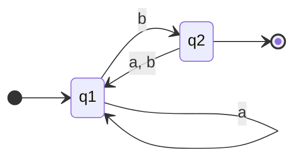
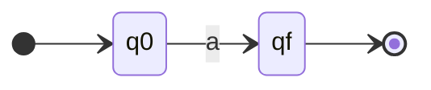
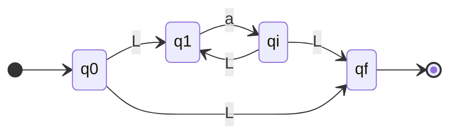
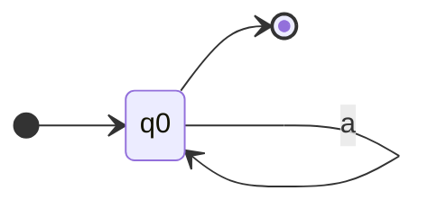
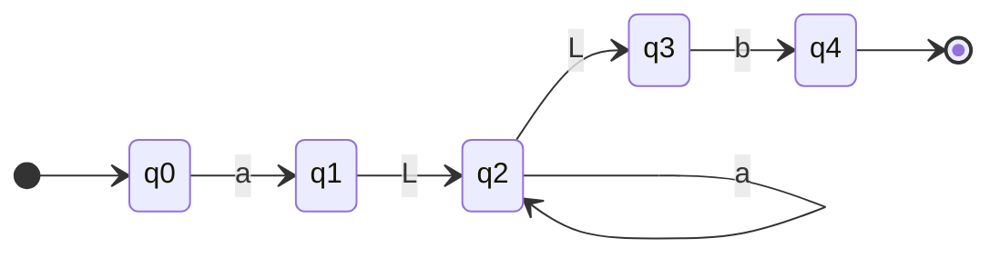
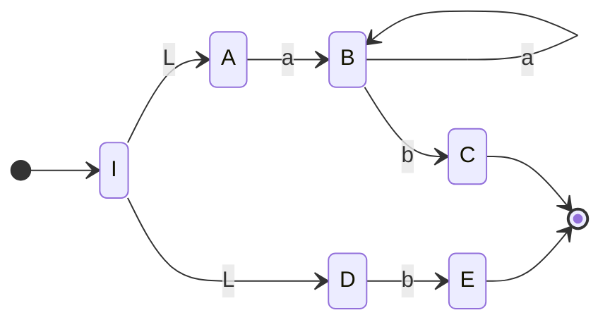
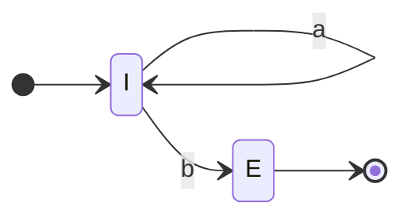

> Dado un alfabeto $\Sigma$, los símbolos $\varnothing$ , $\lambda$ y los operadores $+$ (unión), $.$ (concatenación), ) y $*$ (clausura) y los paréntesis $($ y$)$, definimos una **EXPRESIÓN REGULAR (ER)** sobre el alfabeto $\Sigma$ como
> Base:
> - El símbolo $\varnothing$ es una ER.
> - El símbolo $\lambda$ es una ER.
> - Cualquier símbolo $\alpha \in \Sigma$ a es una ER
> Paso inductivo:
> - Si $\alpha$ y $\beta$ son ER, entonces $\alpha + \beta$ es una ER.
> - Si $\alpha$ y $\beta$ son ER, entonces $\alpha \cdot \beta$ es una ER.
> - Si $\alpha$ es una ER, entonces $\alpha^{*}$ es una ER.
> - Si $\alpha$ es una ER, entonces $(\alpha)$ es una ER.

# Lenguaje descripto por ER
![[Pasted image 20230823151811.png]]

# Precedencia de operadores
1. '*'
2. '.'
3. '+'

# Propiedades de las ER

## Equivalencia de ER's
> Dos ER's $r_1, r_2$ son equivalentes si describen el mismo lenguaje, es decir $L(r_1) = L(r_2)$

## Propiedades 

1. $\alpha + (\beta + \gamma) = (\alpha + \beta) +\gamma$
2. $\alpha + \beta = \beta + \alpha$
3. $\alpha + \varnothing = \alpha$
4. $\alpha +\alpha = \alpha$
5. $\alpha \cdot \lambda = \alpha$
6. $\alpha \cdot \varnothing = \varnothing \cdot \alpha= \varnothing$
7. $\alpha \cdot (\beta \cdot \gamma) = (\alpha \cdot \beta) \cdot \gamma$
8. $\alpha\cdot(\beta +\gamma) = \alpha\beta +\alpha\gamma ~~ \land ~~ (\beta +\gamma)\cdot \alpha = \beta\alpha +\gamma\alpha$
9. $\lambda^{*} = \lambda$
10. $\varnothing^{*}=\lambda$
11. $\alpha\cdot\alpha^{*} = \alpha^{*}\cdot \alpha = \alpha^{+}$
12. $\alpha^{*}= \alpha^{*}\alpha^{*}= (\alpha^{*})^{*}$
13. $\alpha^{*} = \lambda + \alpha \alpha^{*}$
14. $(\alpha + \beta)^{*}=(\alpha^{*}+ \beta^{*})^{*} = \alpha^{*}(\beta\alpha^{*})^{*}$
15. $(\alpha + \beta)^{*} =(\alpha^{*} \cdot \beta^{*})^{*} = (\alpha^{*}+ \beta^{*})\cdot \alpha^{*} = (\alpha^{*}\beta)^{*}\alpha^{*}$
16. $\alpha \cdot(\beta\cdot\alpha)^{*}= (\alpha\cdot \beta)^{*}\alpha$

![[Pasted image 20230823152322.png]]

# Conversión de [[Autómatas Finitos]] a ER

## Teorema de análisis de Kleene

>Todo lenguaje definido mediante un AFD también ese define mediante una $ER$

> Si $L$ es un lenguaje aceptador por un autómata finito $M$, entonces existe una expresión regular $\alpha$ tal que $L = L(M)=L(\alpha)$

### Método de Ecuaciones Características

1. Obtener las ecuaciones características del autómata.
2. Resolver el sistema de ecuaciones.
3. Obtener la solución para el estado inicial.

Sea $x_i = \alpha_{i0}+\alpha_{i1}x_1 + \ldots + \alpha_{in}x_n$. Donde cada $a_{ij}$ es una ER. una solución para $x_i$ es una ER.
A una ecuación de la forma $X = \alpha X + \beta$ donde $\alpha, \beta$ son ER, se llama **ecuación fundamental** de ER's.

> **Lema de Arden**
> $$X = \alpha X + \beta \iff X= a^{*}\beta ~y~es~unica~si~ \lambda \notin L(\alpha)$$

![[Pasted image 20230823154439.png]]
-
#### Ejemplo

$$q_1 = aq_1 + bq_2 \tag{1}$$
$$q_2 =\lambda + aq_1 + bq_1 \tag{2}$$

Luego por distributiva
$$q_2 = \lambda + (a+b)q_1 \tag{3}$$

Por lema de Arden
$$q_1 = a^{*}bq_2 \tag{4}$$

Por (4) y (3)

$$
q_2 = \lambda + (a+b)a^{*}bq_2 \tag{4.5}
$$
Nuevamente por Arden
$$
q_2 = \lambda + ((a+b)a^{*}b)^{*}\lambda = ((a+b)a^{*}b)^{*} \tag{5}
$$
Luego en (4) con (5) 
$$
q_1 =a^{*}b((a+b)a^{*}b)^{*}
$$

# Conversión de ER a [[AFD - Autómatas Finitos Deterministicos]]

## Teorema de Síntesis de Kleene
> Todo lenguaje definido por una ER puede definirse mediante un AFND-$\lambda$

Obvio que entonces vale también que  $ER \Rightarrow AFND-\lambda$

## Método de composición de autómatas
> Este autómata tiene un único estado de aceptación y ningún arco que entre al estado inicial o que salga del estado de aceptación.

### $M = M_1 +M_2$
![[Pasted image 20230824192610.png]]

### $M = M_1\cdot M_2$

![[Pasted image 20230824192728.png]]

### $M = M_1^{*}$
![[Pasted image 20230824192806.png]]

#### Ejemplo

$ER= aa^{*}b+b$

a:

a*

$aa^{*}b$

# Demostrar que un Lenguajes es Regular

> Cuando:
> - encuentro una [[AFD - Autómatas Finitos Deterministicos]] que lo reconoce
> - encuentro un ER que lo describa
> - hay una [[Gramática]] que lo genere

## Conversión de AF a Gramática Regular
> Si existe un lenguaje aceptado por un AF entonces existe una gramática tal que genera el mismo lenguaje.

Se genera $P$ mediante las transiciones en donde $\delta(q, a) = p$ se traduce a $q \rightarrow ap$ y a las terminales $q_f \rightarrow \lambda$.

![[Pasted image 20230830151528.png]]
Análogo a como hacemos las ecuaciones lineales de las ER. solo que en vez de poner $+$ ponemos $|$ .

## Conversión de Gramática Regular a AF
> Si existe un lenguaje generado por una gramática regular entonce existe AF tal que tienen el mismo lenguaje.

Casi inverso a [[#Demostrar que un Lenguajes es Regular#Conversión de AF a Gramática Regular]].

Si tenemos una gramática lineal izquierda, hay que pasar de lineal izquierda a lineal derecha.

![[Pasted image 20230830152135.png]]

# Demostrar que un Lenguaje NO es Regular

> - Todo lenguaje finito es regular
> - Si un lenguaje es infinito, para demostrar que no es regular, se usa el [[#Lema de Bombeo]].

En un lenguaje finito, la cantidad de estados está limitado por la máxima longitud de una palabra.

En un lenguaje infinito, la cantidad de estados también es finita. Entonces necesariamente hay un ciclo o un lazo. De esto se deriva el [[#Lema de Bombeo]].
## Lema de Bombeo

> Si $L$ es un lenguaje regular infinito
> Entonces:
> $\exists n:\forall \omega \in L ,|\omega| \geq n$ podemos dividir en 3 cadenas $\omega = xyz$ de modo que 
> 1. $y \ne \lambda$
> 2. $|xy| \leq n$
> 3. $\forall k \geq 0: xy^{k}z\in L$

El desafío es contradecir el enunciado **mostrando que no se cumple**.
- Encontrar una palabra de longitud mayor o igual que n que no cumple
- pudiendo ser expresada com $\omega = xyz$ de cualquier forma que esa particion se pueda hacer.
- Cumplir
	1. $y = \lambda$
	2. $|xy| \gt n$
	3. $\exists k \geq 0 : xy^{k}z \notin L$

### Demo
![[Pasted image 20230830153546.png]]
![[Pasted image 20230830153606.png]]
![[Pasted image 20230830153622.png]]

### Ejemplo

Sea
$$
L=\{\omega \in \{a, b\}: \omega = a^{m}b^{2m}\}
$$
Demostrar que no es regular, recurro a [[#Lema de Bombeo]] intentando de encontrar una palabra que no lo cumple.

Supongo que sí lo es entonces cumple el lema.
$\exists \omega \in L$ tal que 
- $|\omega| \geq N$ por ejemplo $\omega = a^{N}b^{2N}$ 
- cuya $|\omega| = 3N\geq N$ 
- $\exists x, y, z$ tal que $\omega = xyz$ con $|xy| \leq N$ por lo que $xy = a^{|xy|} \land z = a^{N-|xy|}b^{2N}$

Tiene que comprobarse que $\forall i \geq 0 : xy^{i}z \in L$

Pro ejemplo para $i = 0: xy^{0}z$
- $x = a^{|x|}$
- $z = a^{N-|xy|}b^{2N}$
- $\Rightarrow xz = a^{|x|}a^{N-|xy|}b^{2N} =a^{N-|y|}b^{2N}$
Por este último ítem como implica que $|y| =  0 \Rightarrow y =\lambda$ entonces contradice el lema entonces contradice que es un lenguaje regular. Por ende queda demostrado que no es regular.

