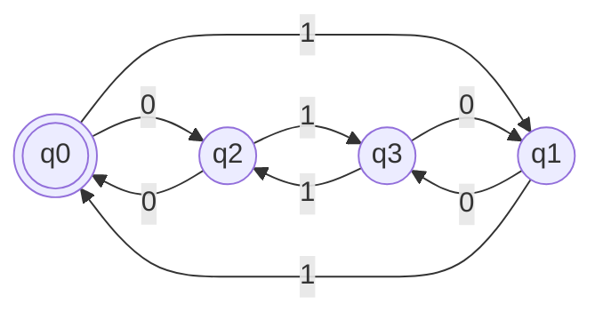
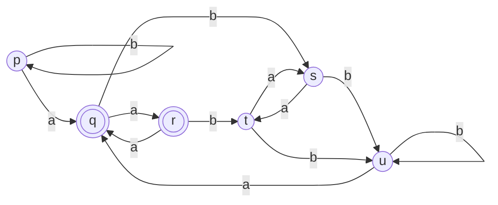
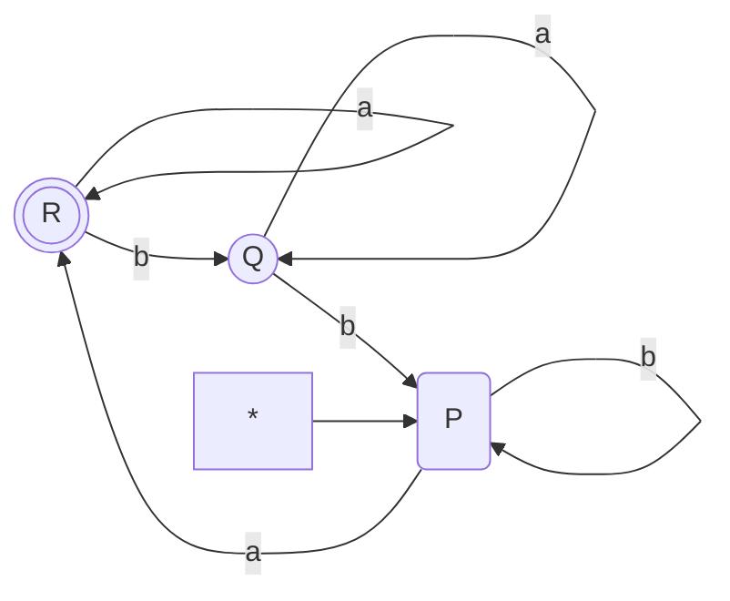
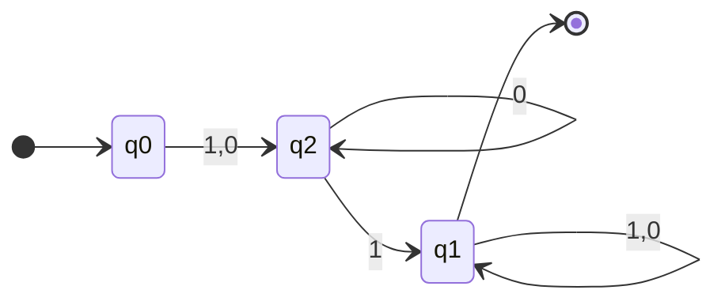
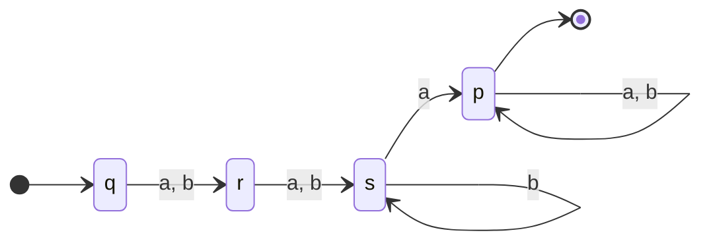
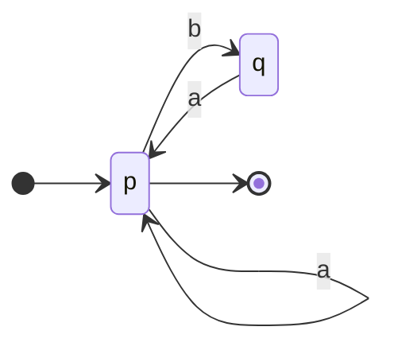
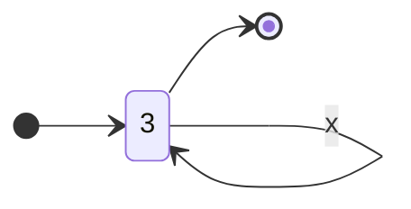
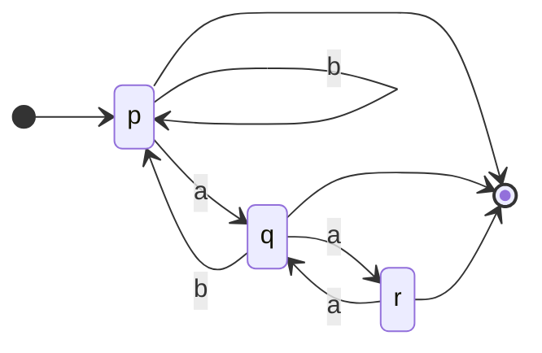
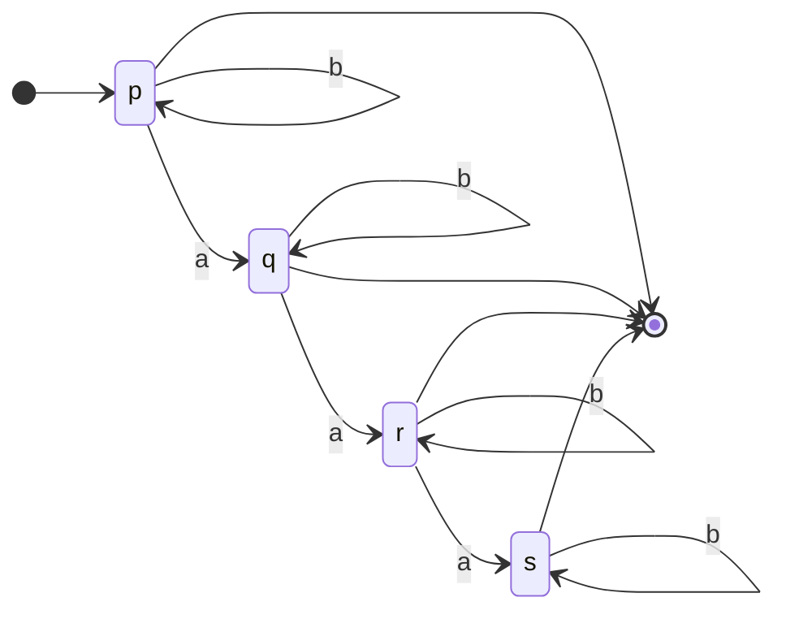
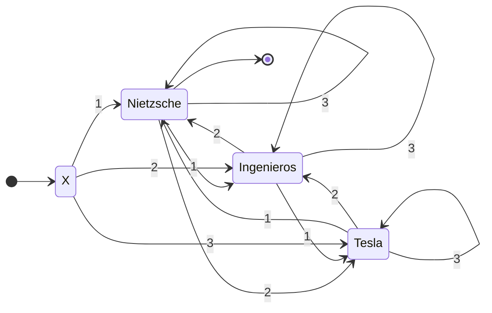

![[Tp03 Lenguajes Regulares Automatas.pdf]]

# 1
Para saber las palabras aceptadas por los [[Autómatas Finitos]] hay que observar el recorrido del grafo generado por el conjunto de estados $Q =\{q_0, q_1, q_2, q_3\}$ . En este caso tenemos el alfabeto de entrada $\Sigma = \{0,1\}$ y el conjunto de estados finales $F = \{q_0\}$
Dibujamos el grafo que se genera dada la tabla.

Ejemplos posibles del diagrama:
$0101, 00,0110, 01111101$
Se puede con observacion atenta se puede ver que siempre termina teniendo un numero par de 1 y 0. Entonces el lenguaje obtenido es:
$$L= \{\omega \in \{0, 1\}^{*}: |\omega|_0 \equiv 0(2) \land |\omega|_1 \equiv 0(2) \}$$
# 2

## A
Ver [[Autómatas Finitos Deterministicos#Minimización de un AFD]].

$$\frac{Q}{E_0}= \{F, Q-F\} = \{\{q, r\}, \{p,s,t,u\}\}$$
Ahora tengo que ver dentro de cada clase cuales de los pares producen una una cadena dentro de la misma clase.
Por ejemplo:

$\delta(q, a) = r \in C_1 ~~~~~~~~ \delta(q, b) = s \in C_2$
$\delta(r, a) = q \in C_1 ~~~~~~~~ \delta(r, b) = t \in C_2$

Por otro lado analizando $C_2$
$\delta(p, a) = q \in C_1 ~~~~~~~~ \delta(p, b) = p \in C_2$
$\delta(s, a) = t \in C_2 ~~~~~~~~ \delta(s, b) = u \in C_2$
$\delta(t, a) = s \in C_2 ~~~~~~~~ \delta(t, b) = u \in C_2$
$\delta(u, a) = q \in C_1 ~~~~~~~~ \delta(u, b) = u \in C_2$

Vemos que no nos lleva a la misma clase
$\Rightarrow \{C_1= \{q, r\} ,C_2 = \{s,t\}, C_3= \{p,u\}\}$

Nos queda que 
$\delta(s, a) = t \in C_2 ~~~~~~~~ \delta(s, b) = u \in C_3$
$\delta(t, a) = s \in C_2 ~~~~~~~~ \delta(t, b) = u \in C_3$
y
$\delta(p, a) = q \in C_1 ~~~~~~~~ \delta(p, b) = p \in C_3$
$\delta(u, a) = q \in C_1 ~~~~~~~~ \delta(u, b) = u \in C_3$

De esto podemos graficar, obtener el Autómata Mínimo y hacer la tabla
$$A = <\{P,Q,R\},\{a,b\}, \delta, P, R>$$

| $\delta$ | a |  b|
|-------------|-| - |
|$P$ |$R$ |$P$ |
|$Q$ |$Q$ |$P$|
|$R$ | $R$| $Q$|

## B

$$\frac{Q}{E_0} = \{\{q_3,q_4,q_5\}, \{\bar{q_0}, q_1, q_2\}\}$$

$$
C_2:
\begin{cases}
	\delta(q_0, 0) = q_1 \in C_2 ~~~~ \delta(q_0, 1) = q_2 \in C_2\\
	\delta(q_1, 0) = q_2 \in C_2 ~~~~  \delta(q_1, 1) = q_3 \in C_1\\
	\delta(q_2, 0) = q_2 \in C_2 ~~~~ \delta(q_2, 1) = q_4 \in C_1\end{cases}
$$
$$
C_1:
\begin{cases}
	\delta(q_3, 0) = q_3 \in C_1 ~~~~ \delta(q_3, 1) = q_3 \in C_1\\
	\delta(q_4, 0) = q_4 \in C_1 ~~~~ \delta(q_4, 1) = q_4 \in C_1\\
	\delta(q_5, 0) = q_5 \in C_1 ~~~~ \delta(q_5, 1) = q_4 \in C_1
\end{cases}
$$
Vemos que en $C_2$ vamos a dividir en dos clases distintas $C_2$ y $C_3$
$$\frac{Q}{E_1} = \{\underbrace{\{q_3, q_4, q_5\}}_{C_1=q_1},\underbrace{ \{q_1,q_2\}}_{C_2 = q_2}, \underbrace{\{\bar{q_0}\}}_{C_3 = q_0}\}$$
$$
C_2:
\begin{cases}
	\delta(q_1, 0) = q_2 \in C_2 ~~~~  \delta(q_1, 1) = q_3 \in C_1\\
	\delta(q_2, 0) = q_2 \in C_2 ~~~~ \delta(q_2, 1) = q_4 \in C_1
\end{cases}
$$
$$
C_3 : 
\begin{cases}\delta(q_0, 0) = q_1 \in C_2 ~~~~ \delta(q_0, 1) = q_2 \in C_2
\end{cases}
$$

$$
C_1:
\begin{cases}
	\delta(q_3, 0) = q_3 \in C_1 ~~~~ \delta(q_3, 1) = q_3 \in C_1\\
	\delta(q_4, 0) = q_4 \in C_1 ~~~~ \delta(q_4, 1) = q_4 \in C_1\\
	\delta(q_5, 0) = q_5 \in C_1 ~~~~ \delta(q_5, 1) = q_4 \in C_1
\end{cases}
$$

Luego ya no hay elementos de las clases que vayan a elementos diferentes que no pertenecen a la clase propia, entonces finalizamos.

## C

$$\frac{Q}{E_0} = \{q_5, \{q_0, \ldots, q_4\}\}$$
$$
C_2\begin{cases}
\delta(q_0, a) = q_1 \in C_2 ~~~~~~~~  \delta(q_0, b) = q_2 \in C_2\\
\delta(q_1, a) = q_3 \in C_2 ~~~~~~~~  \delta(q_1, b) = q_4 \in C_2\\
\delta(q_2, a) = q_4 \in C_2 ~~~~~~~~  \delta(q_2, b) = q_3 \in C_2\\
\begin{rcases}
	\delta(q_3, a) = q_5 \in C_1 &&  \delta(q_3, b)= q_4 \in C_2 \\
	\delta(q_4, a) = q_5 \in C_1 &&  \delta(q_4, b) = q_3 \in C_2\\
\end{rcases} ~diferentes
\end{cases}
$$

Continuo separando
$$\frac{Q}{E_1} = \{q_5, \{q_0, q_1, q_2\}, \{q_3, q_4\}\}$$

$$
C_2\begin{cases}
\delta(q_0, a) = q_1 \in C_2 &&  \delta(q_0, b) = q_2 \in C_2\\
\delta(q_1, a) = q_3 \in C_3 &&  \delta(q_1, b) = q_4 \in C_3\\
\delta(q_2, a) = q_4 \in C_3 &&  \delta(q_2, b) = q_3 \in C_3\\
\end{cases}
$$

$$
C_3
\begin{cases}
	\delta(q_3, a) = q_5 \in C_1 &&  \delta(q_3, b)= q_4 \in C_3 \\
	\delta(q_4, a) = q_5 \in C_1 &&  \delta(q_4, b) = q_3 \in C_3\\
\end{cases}
$$

Vuelvo a separar pues en $C_2$ tenemos elementos que van a diferentes clases:
$$\frac{Q}{E_2} 
= \{
\underbrace{q_5 }_{C_1 = p},
\underbrace{q_0 }_{C_2 = q},
\underbrace{\{q_1, q_2\} }_{C_3 = r},
\underbrace{\{q_3, q_4\}}_{C_4 = s}\}
$$
Y acá ya queda bien definido. Luego nos queda:

# 3
## A
Palabras donde b es precedido inmediatamente por a.

## B
$n \in \mathbb{N} : n \equiv 0(3)$

## C
Palabras que no tengan $abaab$

## D
Palabras que no tengan más de 3 a's

## E
$L = \{x:x\in\{1, 2, 3\}^{*} \land |x| \gt 0\}$
Y sea $x = x_0x_1\ldots x_n2 \Rightarrow (\sum_{i = 0}^nx_i) + 2\equiv 0(3) \qquad n \geq 1$

Hay que separar los estados posibles
- Nietzsche: Estado 0 : la suma es $(\sum_{i = 0}^nx_i) + 2 = 0\mod(3)$
	- Suma 1 : se mueve al estado 1
	- Suma 2 : se mueve al estado 2
	- Suma 3 : se mueve al estado 0
- Ingenieros: Estado 1 : la suma es $(\sum_{i = 0}^nx_i) + 2 = 1\mod(3)$
	- Suma 1 : se mueve al estado 2
	- Suma 2 : se mueve al estado 0
	- Suma 3 : se mueve al estado 1
- Tesla :Estado 2 : la suma es $(\sum_{i = 0}^nx_i) + 2 = 2\mod(3)$
	- Suma 1 : se mueve al estado 0
	- Suma 2 : se mueve al estado 1
	- Suma 3 : se mueve al estado 2

Desde un inicio se puede decir que se encuentra en el **estado 1** pues el 2 está asegurado. El unico nodo de aceptación va a ser el de estado 0 ya que este es el que me dice que es multiplo de 3.

# 4

