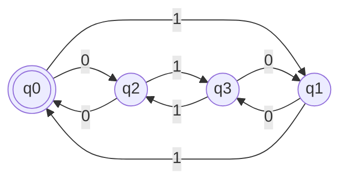
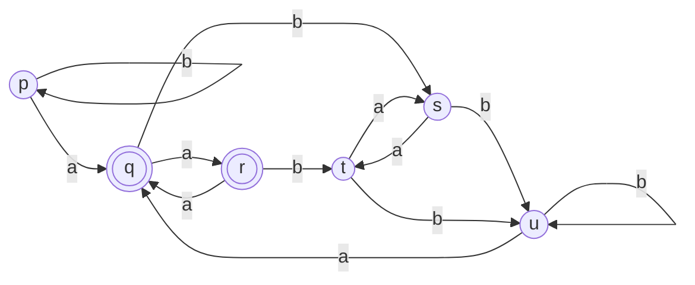

![[Tp03 Lenguajes Regulares Automatas.pdf]]

# 1
Para saber las palabras aceptadas por los [[Autómatas Finitos]] hay que observar el recorrido del grafo generado por el conjunto de estados $Q =\{q_0, q_1, q_2, q_3\}$ . En este caso tenemos el alfabeto de entrada $\Sigma = \{0,1\}$ y el conjunto de estados finales $F = \{q_0\}$
Dibujamos el grafo que se genera dada la tabla.

Ejemplos posibles del diagrama:
$0101, 00,0110, 01111101$
Se puede con observacion atenta se puede ver que siempre termina teniendo un numero par de 1 y 0. Entonces el lenguaje obtenido es:
$$L= \{\omega \in \{0, 1\}^{*}: |\omega|_0 \equiv 0(2) \land |\omega|_1 \equiv 0(2) \}$$
# 2

Ver [[Autómatas Finitos Deterministicos#Minimización de un AFD]].

$$\frac{Q}{E_0}= \{F, Q-F\} = \{\{q, r\}, \{p,s,t,u\}\}$$
Ahora tengo que ver dentro de cada clase cuales de los pares producen una una cadena dentro de la misma clase.
Por ejemplo:
$\delta(q, a) = $

$$\frac{Q}{E_1} = \{\}$$

