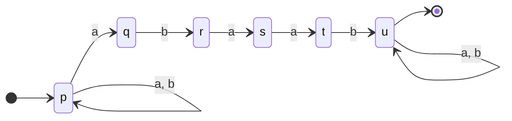

![[Tp03 Lenguajes Regulares Automatas.pdf]]


# 1
Para saber las palabras aceptadas por los [[Autómatas Finitos]] hay que observar el recorrido del grafo generado por el conjunto de estados $Q =\{q_0, q_1, q_2, q_3\}$ . En este caso tenemos el alfabeto de entrada $\Sigma = \{0,1\}$ y el conjunto de estados finales $F = \{q_0\}$
Dibujamos el grafo que se genera dada la tabla.


Ejemplos posibles del diagrama:
$0101, 00,0110, 01111101$
Se puede con observacion atenta se puede ver que siempre termina teniendo un numero par de 1 y 0. Entonces el lenguaje obtenido es:
$$L= \{\omega \in \{0, 1\}^{*}: |\omega|_0 \equiv 0(2) \land |\omega|_1 \equiv 0(2) \}$$
# 2

## A
Ver [[AFD - Autómatas Finitos Deterministicos#Minimización de un AFD]].


$$\frac{Q}{E_0}= \{F, Q-F\} = \{\{q, r\}, \{p,s,t,u\}\}$$
Ahora tengo que ver dentro de cada clase cuales de los pares producen una una cadena dentro de la misma clase.
Por ejemplo:

$\delta(q, a) = r \in C_1 ~~~~~~~~ \delta(q, b) = s \in C_2$
$\delta(r, a) = q \in C_1 ~~~~~~~~ \delta(r, b) = t \in C_2$

Por otro lado analizando $C_2$
$\delta(p, a) = q \in C_1 ~~~~~~~~ \delta(p, b) = p \in C_2$
$\delta(s, a) = t \in C_2 ~~~~~~~~ \delta(s, b) = u \in C_2$
$\delta(t, a) = s \in C_2 ~~~~~~~~ \delta(t, b) = u \in C_2$
$\delta(u, a) = q \in C_1 ~~~~~~~~ \delta(u, b) = u \in C_2$

Vemos que no nos lleva a la misma clase
$\Rightarrow \{C_1= \{q, r\} ,C_2 = \{s,t\}, C_3= \{p,u\}\}$

Nos queda que 
$\delta(s, a) = t \in C_2 ~~~~~~~~ \delta(s, b) = u \in C_3$
$\delta(t, a) = s \in C_2 ~~~~~~~~ \delta(t, b) = u \in C_3$
y
$\delta(p, a) = q \in C_1 ~~~~~~~~ \delta(p, b) = p \in C_3$
$\delta(u, a) = q \in C_1 ~~~~~~~~ \delta(u, b) = u \in C_3$

De esto podemos graficar, obtener el Autómata Mínimo y hacer la tabla
$$A = <\{P,Q,R\},\{a,b\}, \delta, P, R>$$


| $\delta$ | a |  b|
|-------------|-| - |
|$P$ |$R$ |$P$ |
|$Q$ |$Q$ |$P$|
|$R$ | $R$| $Q$|


## B

$$\frac{Q}{E_0} = \{\{q_3,q_4,q_5\}, \{\bar{q_0}, q_1, q_2\}\}$$

$$
C_2:
\begin{cases}
	\delta(q_0, 0) = q_1 \in C_2 ~~~~ \delta(q_0, 1) = q_2 \in C_2\\
	\delta(q_1, 0) = q_2 \in C_2 ~~~~  \delta(q_1, 1) = q_3 \in C_1\\
	\delta(q_2, 0) = q_2 \in C_2 ~~~~ \delta(q_2, 1) = q_4 \in C_1\end{cases}
$$
$$
C_1:
\begin{cases}
	\delta(q_3, 0) = q_3 \in C_1 ~~~~ \delta(q_3, 1) = q_3 \in C_1\\
	\delta(q_4, 0) = q_4 \in C_1 ~~~~ \delta(q_4, 1) = q_4 \in C_1\\
	\delta(q_5, 0) = q_5 \in C_1 ~~~~ \delta(q_5, 1) = q_4 \in C_1
\end{cases}
$$
Vemos que en $C_2$ vamos a dividir en dos clases distintas $C_2$ y $C_3$
$$\frac{Q}{E_1} = \{\underbrace{\{q_3, q_4, q_5\}}_{C_1=q_1},\underbrace{ \{q_1,q_2\}}_{C_2 = q_2}, \underbrace{\{\bar{q_0}\}}_{C_3 = q_0}\}$$
$$
C_2:
\begin{cases}
	\delta(q_1, 0) = q_2 \in C_2 ~~~~  \delta(q_1, 1) = q_3 \in C_1\\
	\delta(q_2, 0) = q_2 \in C_2 ~~~~ \delta(q_2, 1) = q_4 \in C_1
\end{cases}
$$
$$
C_3 : 
\begin{cases}\delta(q_0, 0) = q_1 \in C_2 ~~~~ \delta(q_0, 1) = q_2 \in C_2
\end{cases}
$$

$$
C_1:
\begin{cases}
	\delta(q_3, 0) = q_3 \in C_1 ~~~~ \delta(q_3, 1) = q_3 \in C_1\\
	\delta(q_4, 0) = q_4 \in C_1 ~~~~ \delta(q_4, 1) = q_4 \in C_1\\
	\delta(q_5, 0) = q_5 \in C_1 ~~~~ \delta(q_5, 1) = q_4 \in C_1
\end{cases}
$$

Luego ya no hay elementos de las clases que vayan a elementos diferentes que no pertenecen a la clase propia, entonces finalizamos.


## C

$$\frac{Q}{E_0} = \{q_5, \{q_0, \ldots, q_4\}\}$$
$$
C_2\begin{cases}
\delta(q_0, a) = q_1 \in C_2 ~~~~~~~~  \delta(q_0, b) = q_2 \in C_2\\
\delta(q_1, a) = q_3 \in C_2 ~~~~~~~~  \delta(q_1, b) = q_4 \in C_2\\
\delta(q_2, a) = q_4 \in C_2 ~~~~~~~~  \delta(q_2, b) = q_3 \in C_2\\
\begin{rcases}
	\delta(q_3, a) = q_5 \in C_1 &&  \delta(q_3, b)= q_4 \in C_2 \\
	\delta(q_4, a) = q_5 \in C_1 &&  \delta(q_4, b) = q_3 \in C_2\\
\end{rcases} ~diferentes
\end{cases}
$$

Continuo separando
$$\frac{Q}{E_1} = \{q_5, \{q_0, q_1, q_2\}, \{q_3, q_4\}\}$$

$$
C_2\begin{cases}
\delta(q_0, a) = q_1 \in C_2 &&  \delta(q_0, b) = q_2 \in C_2\\
\delta(q_1, a) = q_3 \in C_3 &&  \delta(q_1, b) = q_4 \in C_3\\
\delta(q_2, a) = q_4 \in C_3 &&  \delta(q_2, b) = q_3 \in C_3\\
\end{cases}
$$

$$
C_3
\begin{cases}
	\delta(q_3, a) = q_5 \in C_1 &&  \delta(q_3, b)= q_4 \in C_3 \\
	\delta(q_4, a) = q_5 \in C_1 &&  \delta(q_4, b) = q_3 \in C_3\\
\end{cases}
$$

Vuelvo a separar pues en $C_2$ tenemos elementos que van a diferentes clases:
$$\frac{Q}{E_2} 
= \{
\underbrace{q_5 }_{C_1 = p},
\underbrace{q_0 }_{C_2 = q},
\underbrace{\{q_1, q_2\} }_{C_3 = r},
\underbrace{\{q_3, q_4\}}_{C_4 = s}\}
$$
Y acá ya queda bien definido. Luego nos queda:


# 3
## A
Palabras donde b es precedido inmediatamente por a.


## B
$n \in \mathbb{N} : n \equiv 0(3)$
por ejemplo 4->3
- Estado 0 : multiplo de 3
- Estado 1 : módulo 1 
- Estado 2 : módulo 2


## C
Palabras que no tengan $abaab$

Construir este autómata, no es fácil por eso aplicamos la técnica del complemento en el cual armamos el automata que contenga la cadena $abaab$ y luego aplicamos transformaciones para obtener su complemento.


Luego construimos el AFD, y en lo posible minimizamos. Hecho esto convertimos los finales en no finales y viceversa, y obtenemos nuestro AFD resultante.


Luego hacer


## D
Palabras que no tengan más de 3 a's


## E
$L = \{x:x\in\{1, 2, 3\}^{*} \land |x| \gt 0\}$
Y sea $x = x_0x_1\ldots x_n2 \Rightarrow (\sum_{i = 0}^nx_i) + 2\equiv 0(3) \qquad n \geq 1$

Hay que separar los estados posibles
- Nietzsche: Estado 0 : la suma es $(\sum_{i = 0}^nx_i) + 2 = 0\mod(3)$
	- Suma 1 : se mueve al estado 1
	- Suma 2 : se mueve al estado 2
	- Suma 3 : se mueve al estado 0
- Ingenieros: Estado 1 : la suma es $(\sum_{i = 0}^nx_i) + 2 = 1\mod(3)$
	- Suma 1 : se mueve al estado 2
	- Suma 2 : se mueve al estado 0
	- Suma 3 : se mueve al estado 1
- Tesla :Estado 2 : la suma es $(\sum_{i = 0}^nx_i) + 2 = 2\mod(3)$
	- Suma 1 : se mueve al estado 0
	- Suma 2 : se mueve al estado 1
	- Suma 3 : se mueve al estado 2

Desde un inicio se puede decir que se encuentra en el **estado 1** pues el 2 está asegurado. El unico nodo de aceptación va a ser el de estado 0 ya que este es el que me dice que es multiplo de 3.


# 4
> Se cuenta con una canilla y dos jarras, una tiene una capacidad de 4 litros y la otra es de 3 litros.

¿Es posible obtener 2 litros de agua en una de las jarras? Modelar el problema con un AFD y escribir una secuencia de configuraciones que lleve a la solución.

$B1 :$ botella de 3 litros
$B2 :$ botella de 4 litros

- Estado 0 : botellas vacias.
- Estado 1 : botella de 3 litros llena y la de 4 vacia.
- Estado 2 : botella de 3 litros vacia y la de 4 llena.
- Estado 3 : botella de 3 litros llena y la de 4 llena.
- Estado 4 : botella de 4 litros con 3 litros y la de 3 litros vacia
- Estado 5 : B1 y B2 con 3 litros
- Estado 6 : 4 litros en B2 y 2 litros en B1
- Estado A : botella con 2 litros


# 5
$$
\{\{s, t, u, v\}, \{p,q,r\}\}
$$
$$
\begin{cases}
\delta(s, a) = q \in C_2 & \delta(s, b) = t \in C_1& \delta(p, c) = u \in C_1\\
\delta(t, a) = t \in C_1 & \delta(t, b) = v \in C_1& \delta(t, c) = u \in C_1\\
\delta(u, a) = t \in C_1 & \delta(u, b) = t \in C_1 & \delta(
u, c) = v \in C_1\\
\delta(v, a) = u \in C_1 & \delta(v, b) = u \in C_1 & \delta(v, c) = t \in C_1\\
\end{cases}
$$
$$
\begin{cases}
\delta(p, a) = r \in C_2 & \delta(p, b) = t \in C_1& \delta(p, c) = q \in C_2\\
\delta(q, a) = q \in C_2 & \delta(q, b) = v \in C_1& \delta(q, c) = p \in C_2\\
\delta(r, a) = p \in C_2 & \delta(r, b) = u \in C_1 & \delta(r, c) = r \in C_2\\
\end{cases}
$$

Separo las que son de clases diferentes
$$
\Rightarrow 
\begin{cases}
\delta(t, a) = t \in C_1 & \delta(t, b) = v \in C_1& \delta(t, c) = u \in C_1\\
\delta(u, a) = t \in C_1 & \delta(u, b) = t \in C_1 & \delta(
u, c) = v \in C_1\\
\delta(v, a) = u \in C_1 & \delta(v, b) = u \in C_1 & \delta(v, c) = t \in C_1\\
\end{cases}
$$
$$
\begin{cases}
\delta(s, a) = q \in C_2 & \delta(p, b) = t \in C_1& \delta(p, c) = u \in C_1\\
\end{cases}
$$

Luego minimizando $A_2$

$$
\{\{p, q\}, \{r, s, t\}\}
$$
$$
\begin{cases}
	\delta(p, a) = s \in C_2 & \delta(p, b) = q \in C_1 & \delta(p, c) = p \in C_1\\
	\delta(q, a) = t \in C_2 & \delta(q, b) = p \in C_1 & \delta(q, c) = q \in C_1\\
\end{cases}
$$
$$
\begin{cases}
	\delta(r, a) = q \in C_1 & \delta(r, b) = t \in C_2 & \delta(r, c) = s \in C_2\\
	\delta(s, a) = s \in C_2 & \delta(s, b) = t \in C_2 & \delta(s, c) = s \in C_2\\
	\delta(t, a) = t \in C_2 & \delta(t, b) = s \in C_2 & \delta(t, c) = s \in C_2\\
	
\end{cases}
$$
Separo $\{\{p, q\},  \{s, t\},\{r\}\}$

$$
\begin{cases}
	\delta(r, a) = q \in C_1 & \delta(r, b) = t \in C_2 & \delta(r, c) = s \in C_2\\
\end{cases}
$$


Luego 

Si miramos con atención vemos que no son el mismo diagrama de estados.


#ParcialTLA
El estado $\varnothing$ existe en los estados no terminales (es el estado al que van las cosas si está vacío el slot en la tabla)
# 6
$$L = \{a^{n}:n\geq 0\} \cup \{b^{n}a:n\geq 1\}$$
Este lenguaje genera por ejemplo las palabras:
- ba
- aba
- aabba
- aaba
- aaaaaaaaabbbbbbbbbbbbbbbbbbbbbbbbbbbbbbbbbbbbbbbbba


Este autómata es $A = <\{a, b\}, \{p, q, r,s, t, u\}, \delta, p, \{s, u\}>$

# 7

## a
#### Primera forma práctica
Para arrancar, calculo las clausuras de los elementos
$$
\begin{cases}
clausura(q_0) = \{q_0\}\\
clausura(q_1) = \{q_1, q_2\}\\
clausura(q_2) = \{q_2\}
\end{cases}
$$
Hago la tabla con $\lambda$  donde hago todos los posibles alcances a distancia de un único paso sin incluirse a sí mismos. Aquel estado que no tenga una transición completa se le asigna la transición a un estado trampa $T$. En las transiciones de lambda no pongo $T$ pues no existe esa transición.

| $\delta$ | $\lambda$  | $0$ | $1$|
| -- | --  | -- | -- |
| $\rightarrow q_0$ |   | $\{q_1\}$ | $\{q_1\}$ |
| $*q_1$ | $\{q_2\}$  | $\{q_0, q_2\}$ | $\{q_1\}$ |
| $q_2$ |   | $T$ | $\{q_1\}$ |
| $T$ |   | $T$ | $T$ |

Luego, hago otra tabla sin $\lambda$ en la que anoto todas las transiciones posibles de longitud uno, tomando en cuenta que $\lambda$ no consume. Recordar que si se está parado en un estado, las conexiones $\lambda$ permiten que sea equivalente estar parado en el siguiente estado.
![[Pasted image 20230817183642.png]]
Entonces nos queda la tabla

| $\delta$ | $0 = \lambda(\delta(q_i, 0))$| $1 = \lambda(\delta(q_i, 1))$ |
| -- | --- | --|
| $q_0$ | $q_1, q_2$ | $q_1, q_2$ |
| $q_1$ | $q_0, q_2$ | $q_1, q_2$ |
| $q_2$ | $T$ | $q_1, q_2$ |
| $T$ | $T$ | $T$ |

Luego esta tabla la pasaremos a DFA. Comenzando en la primera celda con $\lambda(q_0)$


|$\delta$ | $0$| $1$  |  
| -- | -- | -- |
| $q_0 : A$ | $\{q_1, q_2\} \cup \varnothing :B$ | $\{q_1, q_2\} \cup \varnothing : B$| 
|$\{q_1, q_2\}\cup \varnothing :B$ | $\{q_0, q_2\}: C$ | $\{q_1, q_2\} :B$|
|$\{q_0, q_2\} : C$ | $\{q_1, q_2\} :B$| $\{q_1, q_2\}:B$ |


#### Segunda forma medio fea (youtube)
Para arrancar, calculo las clausuras de los elementos

$$
\begin{cases}
clausura(q_0) = \{q_0\}\\
clausura(q_1) = \{q_1, q_2\}\\
clausura(q_2) = \{q_2\}
\end{cases}
$$
Hago la tabla con $\lambda$

| $\delta$ | $\lambda$  | $0$ | $1$|
| -- | --  | -- | -- |
| $\rightarrow q_0$ | $\{q_0\}$  | $\{q_1\}$ | $\{q_1\}$ |
| $*q_1$ | $\{q_1, q_2\}$  | $\{q_0, q_2\}$ | $\{q_1\}$ |
| $q_2$ | $\{q_2\}$  | $\varnothing$ | $\{q_1\}$ |

Luego hago la tabla sin $\lambda$

| $\delta$ | $0$ |  $1$ |
| -- | -- | -- |
|$\rightarrow \{q_0\} : A$ | $\{q_1\} : B$ | $\{q_1\} :B$|
|$*\{q_1\} : B$ | $\{q_0, q_2 \} : C$ | $\{q_1\} :B$|
| $\{q_0, q_2\} : C$ | $\{q_1\} :B$| $\{q_1\} : B$|

Finalmente vemos que sea minimal. Como podemos observar 
$$
\frac{Q}{E_0} = \{\{A,C\}, \{B\}\} 
$$
Luego este no es minimal por ende separo nuvamente

$$
A =\begin{cases}
\delta(A, 0) \in C_2 & \delta(A, 1) \in C_2\\
\delta(C, 0) \in C_2 & \delta(C, 1) \in C_2\\
\end{cases}
$$
$$
B = \begin{cases}
\delta(B, 0) \in C_1 & \delta(B, 1) \in C_2\\
\end{cases}
$$


## b

La tabla pura del dibujo es:

| $\delta$ |  $0$ |  $1$ |
| -- | -- | -- |
| $\rightarrow q_0$| $\{q_0, q_1\}$|$\{q_1\}$ | 
| $*q_1$| $\{q_2\}$|$\{q_2\}$ | 
| $q_2$| $T$|$\{q_2\}$ | 

Hago las transiciones del AFD

| $\delta$ |  $0$ |  $1$ |
| -- | -- | -- |
| $\rightarrow q_0 : A$| $\{q_0, q_1\} : B$|$\{q_1\}:C$ | 
| $*\{q_0, q_1\}: B$| $\{q_0, q_1, q_2\} :D$|$\{q_1, q_2\}:E$ | 
| $*\{q_0, q_1, q_2\}:D$| $\{q_0, q_1, q_2\}:D$|$\{q_1,q_2\}:E$ | 
| $*\{q_1, q_2\}:E$| $\{q_2\}:F$|$\{q_2\}:F$ |
| $\{q_2\}:F$| $T$|$\{q_2\}:F$ | 
| $*\{q_1\}:C$| $\{q_2\}:F$|$\{q_2\}:F$ | 
| $T$| $T$|$T$ | 

$$
\frac{Q}{E_0} = \{\{C,B,D,E\}, \{A,F, T\}\}
$$
$$
\begin{cases}
\delta(C, 0) = F \in C_2 & \delta (C, 1) = F \in C_2\\
\delta(B, 0) = D \in C_1 & \delta (B, 1) = E \in C_1\\
\delta(D, 0) = D \in C_1 & \delta (D, 1) = E \in C_1\\
\delta(E, 0) = F \in C_2 & \delta (E, 1) = F \in C_2\\\\
\delta(A, 0) = B \in C_1 & \delta (A, 1) = C \in C_1\\
\delta(F, 0) = T \in C_2 & \delta (F, 1) = F \in C_2\\
\delta(T, 0) = T \in C_2 & \delta (T, 1)  = T \in C_2
\end{cases}~~~ \Rightarrow \{\{B,D\}, \{C,E\}, \{A\},\{F,T\}\}
$$
$$
\Rightarrow 
\begin{cases}
\delta(B, 0) = D \in C_1 & \delta (B, 1) = E \in C_2\\
\delta(D, 0) = D \in C_1 & \delta (D, 1) = E \in C_2\\\\
\delta(C, 0) = F \in C_4 & \delta (C, 1) = F \in C_4\\
\delta(E, 0) = F \in C_4 & \delta (E, 1) = F \in C_4\\\\
\delta(A, 0) = B \in C_1 & \delta (A, 1) = C \in C_1\\\\
\delta(F, 0) = T \in C_4 & \delta (F, 1) = F \in C_4\\
\delta(T, 0) = T \in C_4 & \delta (T, 1)  = T \in C_4
\end{cases}
$$


## c

1. Clausuras

$$
\begin{cases}
clausura(q_0) = \{q_0\} \cup \{ q_2, q_3\}\\
clausura(q_1) = \{q_1\} \cup \varnothing\\
clausura(q_2) = \{q_2 \} \cup \{q_3\}\\
clausura(q_3) = \{ q_3\}\cup \varnothing\\
\end{cases}
$$

2. Tabla con $\lambda$

| $\delta$ |  $\lambda$|  $0$ | $1$ |
| -- | -- | -- | -- | 
| $q_0$ | $\{q_2, q_3\}$| $T$ | $\{q_1, q_2\}$ |
| $q_1$ | | $\{q_0\}$ | $\{q_0, q_1\}$ |
| $q_2$ | $\{q_3\}$ | $\{q_2\}$ | $T$ |
| $q_3$ |  | $T$ | $T$ |

3. Tabla sin $\lambda$

| $\delta$  | $0$ |  $1$ |
| --  |  -- |  -- |
| $\rightarrow \{q_0\}\cup \{q_2, q_3\} :A$ | $\{q_2\}\cup \{q_3\} :B$ | $\{q_1, q_2\} \cup \{q_3\} :C$ |
| $\{q_2\}\cup \{q_3\} :B$ | $\{q_2\}\cup\{q_3\}: B$|  $T$|
| $*\{q_1, q_2\} \cup \{q_3\} :C$ | $\{q_0, q_2\} \cup \{q_3\}: D$| $\{q_0, q_1\} \cup \{q_2, q_3\}:E$|
| $\{q_0, q_2\} \cup \{q_3\}: D$ | $\{q_2\} \cup \{q_3\} : B$| $\{q_1, q_2\} \cup \{q_3\} : C$|
| $*\{q_0, q_1\} \cup \{q_2, q_3\}:E$ | $\{q_0\} \cup \{q_2, q_3\} :A$| $\{q_0, q_1, q_2\} \cup \{q_3\} : E$|

4. Minimización

$$
\frac{Q}{E_0} = \{\{C,E\}, \{A, B,D, T\}\}
$$
$$
\begin{cases}
\delta(A, 0) = B \in C_2 && \delta(A, 1) = C \in C_1\\
\delta(B, 0) = B \in C_2 && \delta(B, 1) = T \in C_2\\
\delta(T, 0) = T \in C_2 && \delta(E, 1) = T \in C_2\\
\delta(D, 0) = B \in C_2 && \delta(D, 1) = C \in C_1\\\\
\delta(C, 0) = D \in C_2 && \delta(C, 1) = E \in C_1\\
\delta(E, 0) = A \in C_2 && \delta(E, 1) = E \in C_1\\
\end{cases}
$$

Divido
$$
\frac{Q}{E_0} = \{\{C, E\}, \{B, T\}, \{A, D\}\}
$$
$$
\begin{cases}
\delta(C, 0) = D \in C_3 && \delta(C, 1) = E \in C_1\\
\delta(E, 0) = A \in C_3 && \delta(E, 1) = E \in C_1\\\\
\delta(B, 0) = B \in C_2 && \delta(B, 1) = T \in C_2\\
\delta(T, 0) = T \in C_2 && \delta(E, 1) = T \in C_2\\\\
\delta(A, 0) = B \in C_2 && \delta(A, 1) = C \in C_1\\
\delta(D, 0) = B \in C_2 && \delta(D, 1) = C \in C_1\\\\
\end{cases}
$$


# 8
Obviamente no son equivalentes pues $A_b$ aceota la palabra $a$ pero $A_a$ no. De todas formas, procedemos a la demostración en donde los AFD no son equivalentes.

Para determinar si son equivalente los transformo a AFD minimos y me fijo si son el mismo.
$$
\begin{cases}
\lambda(q_0) = \{q_0\} \cup \{q_1, q_2\}\\
\lambda(q_1) = \{q_1\} \cup \{ q_2\}\\
\lambda(q_2) = \{q_2\} \cup \{ q_1\}\\
\lambda(q_3) = \{q_3\} \cup \varnothing
\end{cases}
$$
## 1
|  $\delta$| $\lambda$  | $a$  | $b$ | 
| -- | -- | -- | --|
| $*\rightarrow q_0$ | $q_1, q_2$ | $T$| $T$|
| $q_1$ | $q_2$ | $q_3$| $T$|
| $*q_2$ | $q_1$ | $T$| $T$|
| $q_3$ |  | $q_3$| $q_2$|

|  $\delta$| $\lambda$  | $a$  | $b$ | 
| -- | -- | -- | --|
| $*\rightarrow p$ |  | $p,q$| $T$|
| $q$ |  | $q$| $r$|
| $*r$ |  | $q$| $T$|
| $s$ | $r$ | $s$| $r$|

## 2
|$\delta$  | $a$ | $b$|
| -- | -- | -- |
| $*\rightarrow q_0, q_1, q_2 :A$ | $q_3 :B$| $T$ |
| $q_3 :B$ | $q_3:B$| $q_1, q_2:C$ |
| $*q_1, q_2 :C$ | $q_3:B$| $T$ |


|$\delta$  | $a$ | $b$|
| -- | -- | -- |
| $*\rightarrow p :A$ | $p,q :B$| $T$ |
| $*p,q :B$ | $p, q:B$| $r:C$ |
| $*r :C$ | $q:D$| $T$ |
| $q :D$ | $q:D$| $r:C$ |


$$
\begin{cases}
\frac{Q_1}{E_0} = \{\{A, C\}, \{B, T\}\}\\
\frac{Q_2}{E_0} = \{\{A,B, C\}, \{ D, T\}\}\\

\end{cases}
$$

$$
Q_1:\begin{cases}
\delta(A, a) = B \in C_2 && \delta(A, b) = T \in C_2\\
\delta(C, a) = B \in C_2 && \delta(C, b) = T \in C_2\\\\
\delta(B, a) = B \in C_2 && \delta(C, b) = C \in C_1\\
\delta(T, a) = T \in C_2 && \delta(T, b) = T \in C_2\\
\end{cases}
$$
$$
Q_2:\begin{cases}
\delta(A, a) = B \in C_1 && \delta(A, b) = T \in C_2\\
\delta(B, a) = B \in C_1 && \delta(B, b) = C \in C_1\\
\delta(C, a) = D \in C_2 && \delta(C, b) = T \in C_2\\\\
\delta(D, a) = D \in C_2 && \delta(D, b) = C \in C_1\\
\delta(T, a) = T \in C_2 && \delta(T, b) = T \in C_2\\
\end{cases}
$$

Luego $\frac{Q_1}{E_1} =\{\{A, C\}, \{B\}, \{T\}\}$ y $\frac{Q_2}{E_1} = \{\{A\}, \{B\}, \{C\}, \{D\}, \{T\}\}$ 

$$
Q_1:\begin{cases}
\delta(A, a) = B \in C_2 && \delta(X, b) = T \in C_3\\
\delta(C, a) = B \in C_2 && \delta(C, b) = T \in C_3\\\\
\delta(B, a) = B \in C_2 && \delta(C, b) = C \in C_1\\\\
\delta(T, a) = T \in C_3 && \delta(T, b) = T \in C_3\\
\end{cases}
$$
$$
Q_2:\begin{cases}
\delta(A, a) = B \in C_2 && \delta(A, b) = T \in C_5\\\\
\delta(B, a) = B \in C_2 && \delta(B, b) = C \in C_3\\\\
\delta(C, a) = D \in C_4 && \delta(C, b) = T \in C_5\\\\
\delta(D, a) = D \in C_4 && \delta(D, b) = C \in C_3\\\\
\delta(T, a) = T \in C_5 && \delta(T, b) = T \in C_5
\end{cases}
$$
## 3


# 9
Parecido al anterior, observemos que $A_b$ reconoce la palabra $aba$ pero $A_a$ no. Luego, no son equivalentes.


# 10
## a
- $L = \{abc, abd, aacd\}$
```mermaid
stateDiagram
direction LR
[*] --> A
A --> B : a
E --> F : c
F --> G : d
B --> E : a
B --> C : b
C --> D : c
C --> G : d
H --> A : lambda
G --> [*]
D --> [*]
```

| $\delta$  | $\lambda$|  $a$ | $b$ | $c$  | $d$ |
| -- | -- | -- | -- | -- | -- |
| $\rightarrow A$ |  | B |  |  | |
| B |  | E | C |  | |
| C |  |  |  | D | G|
| $*D$|  |  |  |  | |
| E |  |  |  | F | |
| F |  |  |  |  | G |
| $*G$ |  |  |  |  |
| H | A |  |  |  |
|  |  |  |  |  |

| $\lambda$ |  $a$ | $b$ | $c$  | $d$ |
| -- | -- | -- | -- | -- |
| $\rightarrow A$ | B | |  |  |
| B | E | C |  |  |
| C |  |  | D | G |
| $*D$|  |  |  |  | |
| E |  |  | F |  |
| F |  |  |  | G |
| $*G$ |  |  |  |  |
|  |  |  |  |  |


Finalmente construimos el AFD mínimo
$$
\frac{Q}{E_0} = \{\{D, G\}, \{A, B, C, E, F, T\}\}
$$
$$
\begin{cases}
\delta(D, a) = T \in C_2 & \delta(D, b) = T \in C_2 & \delta(D, c) = T \in C_2 & \delta(D, d) = T\in C_2 \\
\delta(G, a) = T \in C_2 & \delta(G, b) = T \in C_2 & \delta(G, c) = T \in C_2 & \delta(G, d) = T\in C_2 \\\\
\delta(A, a) = B \in C_2 & \delta(A, b) = T \in C_2 & \delta(A, c) = T \in C_2 & \delta(A, d) = T\in C_2 \\
\delta(B, a) = E \in C_2 & \delta(B, b) = C \in C_2 & \delta(B, c) = T \in C_2 & \delta(B, d) = T\in C_2 \\
\delta(C, a) = T \in C_2 & \delta(C, b) = T \in C_2 & \delta(C, c) = D & \delta(C, d) = G\\
\delta(E, a) = T \in C_2 & \delta(E, b) = T \in C_2 & \delta(E, c) = F \in C_2 & \delta(E, d) = T\in C_2 \\
\delta(F, a) = T \in C_2 & \delta(F, b) = T \in C_2 & \delta(F, c) = T \in C_2 & \delta(F, d) = G\\
\delta(T, a) = T \in C_2 & \delta(T, b) = T \in C_2 & \delta(T, c) = T \in C_2 & \delta(T, d) = T\in C_2 \\
\end{cases}
$$
$$
\frac{Q}{E_1} = \{\{D, G\}, \{A, B, D, T\}, \{C\}, \{F\}\}
$$
$$
\begin{cases}
\delta(D, a) = T \in C_2 & \delta(D, b) = T \in C_2 & \delta(D, c) = T \in C_2 & \delta(D, d) = T\in C_2 \\
\delta(G, a) = T \in C_2 & \delta(G, b) = T \in C_2 & \delta(G, c) = T \in C_2 & \delta(G, d) = T\in C_2 \\\\
\delta(A, a) = B \in C_2 & \delta(A, b) = T \in C_2 & \delta(A, c) = T \in C_2 & \delta(A, d) = T\in C_2 \\
\delta(B, a) = E \in C_2 & \delta(B, b) = C  & \delta(B, c) = T \in C_2 & \delta(B, d) = T\in C_2 \\
\delta(E, a) = T \in C_2 & \delta(E, b) = T \in C_2 & \delta(E, c) = F & \delta(E, d) = T \in C_2 \\
\delta(T, a) = T \in C_2 & \delta(T, b) = T \in C_2 & \delta(T, c) = T \in C_2 & \delta(T, d) = T\in C_2 \\\\
\delta(C, a) = T \in C_2 & \delta(C, b) = T \in C_2 & \delta(C, c) = D & \delta(C, d) = G\\\\
\delta(F, a) = T \in C_2 & \delta(F, b) = T \in C_2 & \delta(F, c) = T \in C_2 & \delta(F, d) = G
\end{cases}
$$

$$
\frac{Q}{E_2} = \{\{D, G\}, \{A, T\},\{B\},\{E\},\{C\},\{F\}\}
$$
$$
\begin{cases}
\delta(D, a) = T \in C_2 & \delta(D, b) = T \in C_2 & \delta(D, c) = T \in C_2 & \delta(D, d) = T\in C_2 \\
\delta(G, a) = T \in C_2 & \delta(G, b) = T \in C_2 & \delta(G, c) = T \in C_2 & \delta(G, d) = T\in C_2 \\\\
\delta(A, a) = B  & \delta(A, b) = T \in C_2 & \delta(A, c) = T \in C_2 & \delta(A, d) = T\in C_2 \\
\delta(T, a) = T \in C_2 & \delta(T, b) = T \in C_2 & \delta(T, c) = T \in C_2 & \delta(T, d) = T\in C_2 \\\\
\delta(B, a) = E \in C_2 & \delta(B, b) = C  & \delta(B, c) = T \in C_2 & \delta(B, d) = T\in C_2 \\\\
\delta(E, a) = T \in C_2 & \delta(E, b) = T \in C_2 & \delta(E, c) = F & \delta(E, d) = T \in C_2 \\\\
\delta(C, a) = T \in C_2 & \delta(C, b) = T \in C_2 & \delta(C, c) = D & \delta(C, d) = G\\\\
\delta(F, a) = T \in C_2 & \delta(F, b) = T \in C_2 & \delta(F, c) = T \in C_2 & \delta(F, d) = G
\end{cases}
$$
$$
\frac{Q}{E_3} = \{\{D, G\}, \{A\},\{T\},\{B\},\{E\},\{C\},\{F\}\} = \frac{Q}{E_4}
$$
```mermaid
stateDiagram
direction LR
[*] --> A
A --> B :a
A --> T : b, c, d
B --> E : a
B --> C : b
B --> T : c, d
C --> DG : c, d
C --> T : a, b
DG --> T : a, b, c, d
E --> F : c
E --> T : a, b, d
F --> DG : d
F --> T : a, b, c
DG --> [*]
```
## b
Hago uno que no acepta palabra vacía porque tengo ganas.

```mermaid
stateDiagram  
direction LR
[*] --> A
A --> B : lambda
A --> C : lambda
A --> D : lambda
B --> B' : a
B --> B : b, c
C --> C' : b
C --> C : a, c
D --> D' : c
D --> D : a, b
B' --> [*]
C' --> [*]
D' --> [*]
```

| $\delta$ | $\lambda$ | $a$ | $b$  | $c$ |
| -- | -- | --- | --- | -- |
| A | B, C, D | T | T | T |
| B |   | B' | B | B |
| C |   | C | C' | C |
| D |   | D | D | D' |
| $*B'$ |   | T | T | T |
| $*C'$ |   | T | T | T |
| $*D'$ |   | T | T | T |


| _ | $\delta$ | $a$ | $b$  | $c$ |
| -- | --- | --- | --| -- |
| $\rightarrow I$ | A+BCD  | A - B'CD |B - BC'D |C - BCD' |
| $*A$ | B'CD  | D - CD | M - C'D |J -CD' |
| $*B$ | BC'D  |  L - B'D | E - BD | G - BD' |
| $*C$ | BCD'  | K - B'C | H - BC' | F - BC |
| D | CD  | D - CD | M - C'D | J - CD' |
| E | BD  | L - B'D | E - BD | G - BD' |
| F | BC  | K - B'C | H - BC' | F - BC |
| $*G$| BD' | R - B'  | O - B | O -  B |
| $*H$| BC' | R - B'  | O - B | O - B |
| $*J$| CD'  | P - C  | S -  C' | P - C |
| $*K$ | B'C  | P - C  | S - C' | P - C |
| $*L$ | B'D |  Q - D | Q -  D | T - D' |
| $*M$ | C'D  | Q - D  | Q - D | T - D' |
| O | B | R - B' | O - B | O - B |
| P | C | P - C | S - C' | P - C |
| Q | D | Q - D | Q - D | T - D' |
| $*R$ | $*B'$ | T | T | T |
| $*S$ | $*C'$ | T | T | T |
| $*T$ | $*D'$ | T | T | T |

I- D-E-F-O-P-Q  -  A-B-C-GH-JK-LM-RST

```mermaid
stateDiagram
[*] --> I
I --> *A : a
I --> *B : b
I --> *C : c
D --> D : a
D --> *LM : b
D --> *JK : c
E --> *LM : a
E --> E  : b
E --> *GH : c
F --> *JK : a
F --> *GH: b
F --> F: c
O --> *RST :a
O --> O :b, c
P --> *RST :b
P --> P : a, c
Q --> *RST :c
Q --> Q : a, b
*A --> D : a
*A --> *LM: b
*A --> *JK: c
*B --> *LM : a
*B --> E : b
*B --> *GH :c
*C --> *JK : a
*C --> *GH : b
*C --> F : c
*GH --> *RST:a
*GH --> O : b, c
*JK --> *RST: b
*JK --> P: a, c
*LM --> *RST : c
*LM --> Q : a, b
*RST --> T : a, b, c

```
## c
```mermaid
stateDiagram  
direction LR
[*] --> A
A --> [*]
A --> B : lambda
A --> C : lambda
A --> D : lambda
B --> BX : a
B --> B : b, c
C --> CX : b
C --> C : a, c
D --> DX : c
D --> D : a, b
BX --> B' : a 
CX --> C' : b
DX --> D' : c
BX --> BX : a, b, c
CX --> CX : a, b, c
DX --> DX : a, b, c
B' --> [*]
C' --> [*]
D' --> [*]
```

$\ldots$

| $\delta$         | $\lambda$ | $a$    | $b$    | $c$    |
| ---------------- | --------- | ------ | ------ | ------ |
| $*\rightarrow A$ | BCD       | T      | T      | T      |
| B                |           | BX     | B      | B      |
| C                |           | C      | CX     | C      |
| D                |           | D      | D      | DX     |
| BX               |           | BX, B' | BX     | BX     |
| CX               |           | CX     | CX, C' | CX     |
| DX               |           | DX     | DX     | DX, D' |
| $*B'$               |           | T      | T      | T      |
| $*C'$               |           | T      | T      | T      | 
| $*D'$               |           | T      | T      | T      | 


| $\delta$            | $a$          | $b$          | $c$         |
| ------------------- | ------------ | ------------ | ----------- |
| $A \rightarrow BCD$ | B - BX, C, D | C - B, CX, D | D -B, C, DX |
| B - BX, C, D        | BX, B', C, D | BX, CX, D    | BX, C, DX   |
| C - B, CX, D        | BX, CX, D    | B, CX, C', D | B,             |


# 11
$$
\forall q\in Q, \forall z \in \Sigma: \#\{p\in Q : \delta(q, z) = p\} \leq 1
$$

$$
\begin{cases}
Q = \{q_0, \ldots q_n\}\\
\Sigma = \{z_0, \ldots , z_n\}\\
\delta(q_i, z_i) = T ~~\forall q_i, z_i
\end{cases}
~~~\lor~~~
\begin{cases}
Q = \{q_0, \ldots q_n, p\}\\
\Sigma = \{z_0, \ldots , z_n\}\\
\delta(q_i, z_i) = p ~~~ z_i\in \Sigma, q_i, p\in Q
\end{cases}
$$


Está diciendo que la transicion de un estado del conjunto $Q$ a otro estado del conjunto $Q$ mediante  la consumición de $z$ es "incompleta".
## Ejemplo
sea $Q = \{A, B\}$
$\Sigma = \{a, b\}$

```mermaid
stateDiagram 
direction LR
[*] --> A
A --> B : a
B --> [*]
```

### AFD
```mermaid
stateDiagram
direction LR
[*] --> A
A --> B : a
A --> T : b
T --> T : a, b
B --> [*]
```
# 12

# 13
[[Lenguaje Regular]]
- Siempre que L es finito, L es regular
- Si tenemos que usar memoria, no es regular ()
- Si L es regular, $L^{C}$ también

a.  Regular
b. Regular
c. Regular
d. Regular
e. NO Regular ----------------------- PREGUNTAR
f. Regular
g. NO regular
h. Regular
i. Regular
j. NO Regular ----------------PREGUNTAR
k. Regular
l. Regular
m. Regular
n. Regular