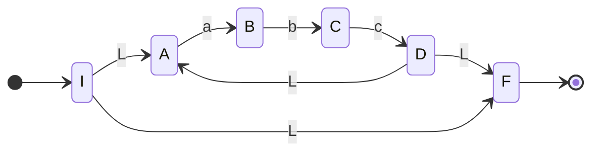
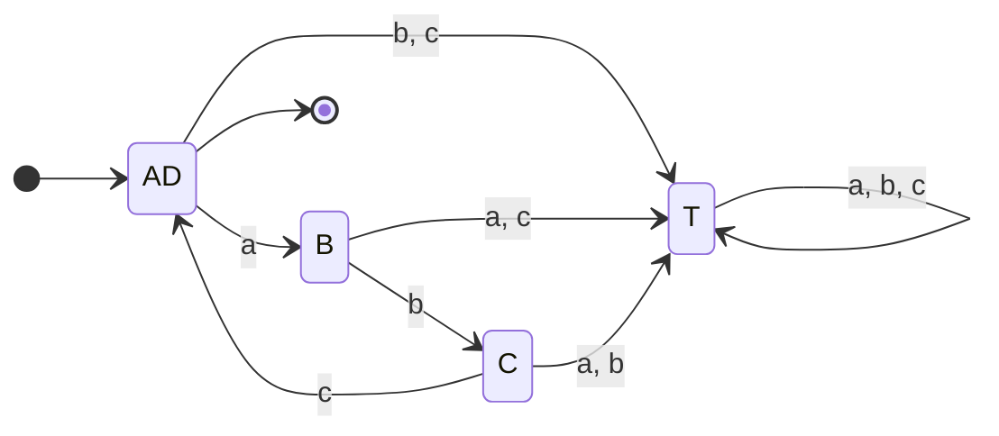
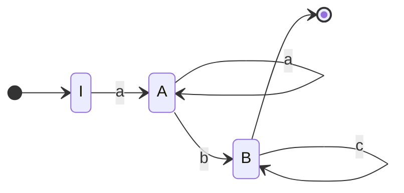
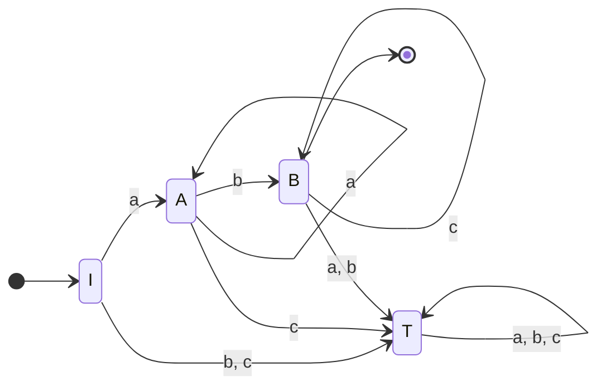
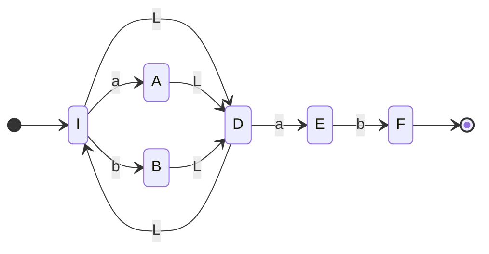
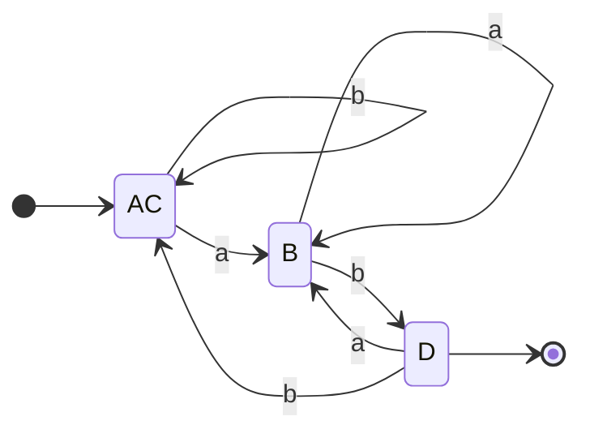
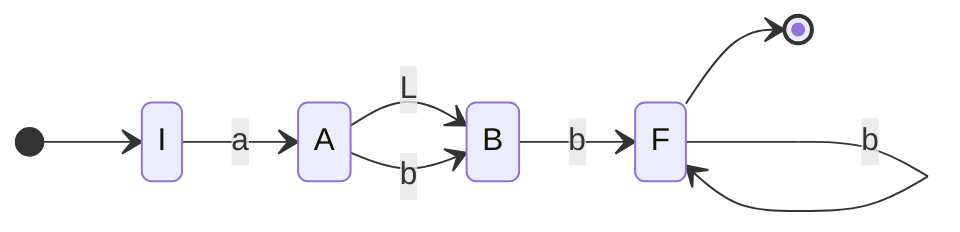
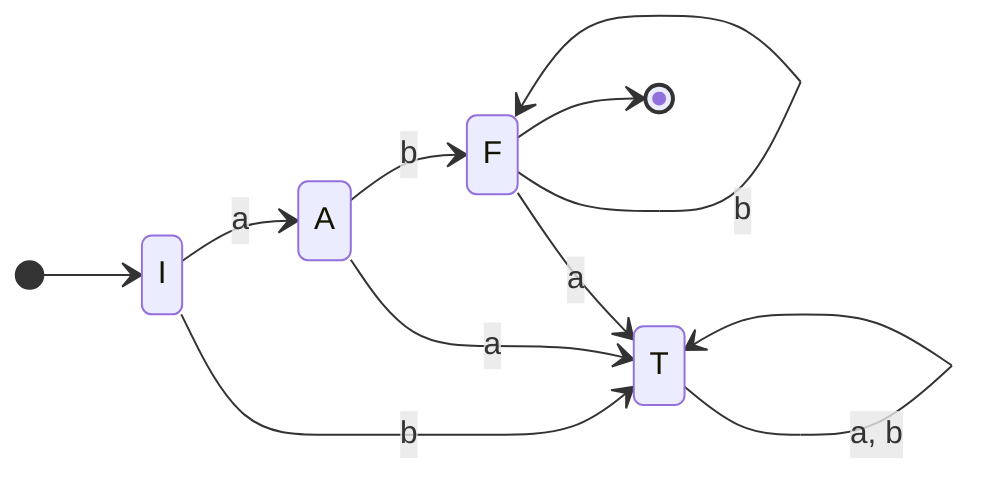

![[Tp04 Lenguajes Regulares Expresiones Regulares.pdf]]

# Índice

- [[#1|1]]
	- [[#1#a|a]]
	- [[#1#b|b]]
	- [[#1#c|c]]
	- [[#1#d|d]]
	- [[#1#e|e]]
	- [[#1#f|f]]
	- [[#1#g|g]]
	- [[#1#h|h]]
	- [[#1#i|i]]
	- [[#1#j|j]]
	- [[#1#k|k]]
	- [[#1#l|l]]
	- [[#1#m|m]]
	- [[#1#n|n]]
- [[#2|2]]
	- [[#2#a|a]]
	- [[#2#b|b]]
	- [[#2#c|c]]
	- [[#2#d|d]]
	- [[#2#e|e]]
	- [[#2#f|f]]
- [[#3|3]]
	- [[#3#a|a]]
	- [[#3#b|b]]
	- [[#3#c|c]]
	- [[#3#d|d]]
	- [[#3#e|e]]
- [[#4|4]]
	- [[#4#a|a]]
	- [[#4#b|b]]
	- [[#4#c|c]]
	- [[#4#d|d]]
- [[#5|5]]
- [[#6|6]]
	- [[#6#a|a]]
	- [[#6#b|b]]
	- [[#6#c|c]]

# 1
Recordando [[Lenguaje Regular]]

## a
$$L = \{\lambda\} \Rightarrow ER = \lambda$$

## b
$$L = \{a, b\} \Rightarrow ER = a + b$$

## c
Recordar [[Lenguaje Regular#Propiedades de las ER]]
$$L =\{aa, ab, ba, bb\} \Rightarrow ER = aa+ab+ba+bb = a\cdot(a+b)+b\cdot(a+b)$$
## d
$$L =\{\lambda,aa, ab, ba, bb\} \Rightarrow ER =\lambda+ aa+ab+ba+bb = \lambda + a\cdot(a+b)+b\cdot(a+b)$$

## e 
NO REGULAR

## f
$$
L = \{a^{i}b^{j}: i, j \geq 0\} \Rightarrow ER = a^{*}\cdot b^{*}
$$
## g
NO REGULAR

## h
$$
L = \{(ab)^{i}: i \geq 0\} \Rightarrow ER = (ab)^{*}
$$
## i
$$L = \{x =\omega\omega^{r}: \omega \in \{0, 1\}^{*}, |x| \lt 5\} \Rightarrow ER = \lambda + 00+ 11+ 0000+ 1111 + 0110 + 1001$$
## j
NO REGULAR
## k
$$
L = \{a^{m}b^{n}cd^{p}:m, n, p \geq 0\} \Rightarrow ER = a^{*}b^{*}cd^{*}
$$
## l
$$
L = \{a\beta c^{n}: n \geq 0, \beta \in \{a, b\}^{+}\}\Rightarrow ER= a\cdot (a+b)^{+}c^{*}
$$
## m
$$
L = \{\omega \in \{0, 1\}^{*}: \omega~contiene~dos~unos~seguidos\} \Rightarrow ER = (1+0)^{*}11(1+0)^{*}
$$
## n
$$
L = \{\omega \in \{0, 1\}^{*}: \omega~NO~contiene~dos~unos~seguidos\} \Rightarrow ER = 0^{*}10^{*}\ldots =0^{*}(10^{+})^{*}(0^{*} + 1)
$$

# 2

## a
> Constantes reales con signo sin ceros no significativos

$$ER = (- + \lambda) \cdot (0 + (1+\ldots +9)(0+1+\ldots +9)^{*}),0^{*}(0+1+\ldots +9)^{*}(1+\ldots +9 + \lambda)$$
## b
> Constantes con notación exponencial

$$
ER = ER_a \times 10 ^{(- + \lambda) (0 | (1\ldots 9)(0\ldots 9)^{*})}
$$
## c

> Identificadores de cualquier longitud que comiencen con una letra, que contengan letras, dígitos o guiones y que no tengan dos guiones seguidos ni terminen en guión.

Sea 
$$
ER_A = (a|\ldots |z) |(A |\ldots | Z)
$$
La expresión regular que expresa cualquier letra, luego

Armamos primero la ER que sería cualquier letra o cualquier numero.

$$
ER_{AN}= (ER_A | (0 |\ldots |9))
$$
Luego:
$$
ER = 
\underbrace{(a | \ldots | z)}_{comienza~con~una~letra}
ER_{AN}^{*}
\cdot
\underbrace{
	(-  ER_{AN}^{+})^{*}
}_{letras,digitos~o~guiones}
$$

## d
> Comentarios acotados por /\*   \*/

$$
ER = /* (a | \ldots |z|A|\ldots|Z|0|\ldots|9| \_|, |.|\ldots)^{*} */
$$
## e
> Expresiones compuestas por enteros, llaves y signo de suma y resta. Por ejemplo $'1+\{2-3\}'$ o $'\{\}\{21-+'$

$$
ER = (0|\ldots | 9 | +|-|\{|\})^{*}
$$

## f
> Idem el anterior pero con llaves que balancean.

Para balancear las llaves hay que llevar un registro de cuántas llaves se abrieron, esto implica que no sea un lenguaje regular. Por ende no existe dicha expresión.

# 3
[[Lenguaje Regular#Equivalencia de ER's]]
Indicar si se cumplen las igualdades
## a
$$
R^{*} | R = R
$$
No se cumple pues digamos que $R = (ab) \Rightarrow abababababab = ab$ Absurdo.

## b
$$
R (SR)^{*} = (RS)^{*}R
$$
Veamos que la izquierda genera $R(SRSRSRSRSRSR)$ siempre terminando en R intercalando R's y S's. De la misma forma en la que lo hace el lado derecho $(RSRSRSRSRSRSRS)R$ 

## c
$$
(R^{*})^{*} = R^{*}
$$
Verdadero por propiedad 12. [[Lenguaje Regular#Propiedades de las ER]]

## d
$$
RR^{*} = R^{+}
$$
Verdadero, son equivalentes.

## e
$$
RR^{+} = R^{+}
$$
Falso pues el lado $RR \ne R$ 

# 4
Construir un AFD mínimo con 
[[Lenguaje Regular#Conversión de ER a AFD - Autómatas Finitos Deterministicos]]

## a
$$
(abc)^{*}
$$

Construyo de a poco

$$
\begin{cases}
\lambda(I) = A, F\\
\lambda(A) = A\\
\lambda(B) = B\\
\lambda(C) = C\\
\lambda(D) = D, F, A\\
\lambda(F) = F\\
\end{cases}
$$

| $\delta$ | a   | b   | c       |
| -------- | --- | --- | ------- |
| $* \rightarrow I, A, F$    | B   | T   | T       |
| B        | T   | C   | T       |
| C        | T   | T   | D, F, A |
| $* D, F, A$  | B   | T   | T       | 

AD, B, C

## b
$$
a^{+}bc^{*}
$$

| $\delta$        | a   | b   | c   |
| --------------- | --- | --- | --- |
| $\rightarrow I$ | A   | T   | T   |
| A               | A   | B   | T   |
| $*B$            | T   | T   | B   |
| T               | T   | T   | T   | 

B, I,T, A

## c
$$
(a|b)^{*}ab
$$

$$
\begin{cases}
\lambda(I) = I, D\\
\lambda(A) = A, D, I\\
\lambda(B) = B, D, I\\
\lambda(D) = D, I\\
\lambda(E) = E\\
\lambda(F) = F\\
\end{cases}
$$

|     | $\delta$           | a          | b             |
| --- | ------------------ | ---------- | ------------- |
|  A   | $\rightarrow I, D$ | A, E, D,I  | B, D,I        |
|  B   | A, E, D, I         | A, E, D, I | B, E, D, I, F |
|  C  | B, D,I             | A, E, D, I | B, D, I       |
|  D  | $*B, E, D, I, F$   | A,E, D, I  | B, D, I       |
|  T   | T                  | T          | T             |

AC, T, B, D

## d
$$
a(b|\lambda)b^{+}
$$

$$
\begin{cases}
\lambda(I) = I \\
\lambda(A) = A, B \\
\lambda(B) = B \\
\lambda(F) = F \\
\end{cases}
$$

| DELTA | a    | b   |
| ----- | ---- | --- |
| -> I  | A, B | T   |
| A, B  | T    | F   |
| \*F   | T    | F   |
| T     | T    | T   |

I, A, F , T

# 5
## a
[[Lenguaje Regular#Conversión de Autómatas Finitos a ER]]

$$
q_0= aq_0 +bq_1
\tag{0}
$$
$$
q_1= aq_2 +bq_0
\tag{1}
$$
$$
q_2= aq_1 +bq_2 + \lambda
\tag{2}
$$

Por lema de Arden en (0)
$$
q_0= a^{*}bq_1
\tag{3}
$$
Reemplazo en (3) en (1)
$$
q_1= aq_2 +b(a^{*}bq_1)
\tag{4}
$$
Por lema de Arden en (4)
$$
q_1=( ba^{*}b)^{*}aq_2 
\tag{5}
$$
Por lema de Arden en (2).
$$
q_2= b^{*} (aq_1 +\lambda) = b^{*}aq_1 +b^{*}
\tag{6}
$$
Reemplazo (5) en (6)
$$
q_2=  b^{*}a( ba^{*}b)^{*}aq_2 +b^{*}
\tag{7}
$$
Luego aplicando Arden a (7)
$$
q_2=  (b^{*}a( ba^{*}b)^{*}a)^{*}b^{*}
\tag{8}
$$
PP15 en (8)
$$
q_2=  (b +a( ba^{*}b)^{*}a)^{*}
\tag{9}
$$
Reemplazando
$$
\begin{cases}
q_0= a^{*}b( ba^{*}b)^{*}a(b +a( ba^{*}b)^{*}a)^{*}\\
q_1=( ba^{*}b)^{*}a(b +a( ba^{*}b)^{*}a)^{*}\\
q_2=  (b +a( ba^{*}b)^{*}a)^{*}
\end{cases}\tag{3,5,9}
$$

PP8.
$$
q_0= a^{*}b( ba^{*}b)^{*}(ab +aa( ba^{*}b)^{*}a)^{*}
$$
Chequeando en [REGEQ](https://bakkot.github.io/dfa-lib/regeq.html) vemos que nos dio bien comparando con el resultado.

# 6
Mostrar [[Lenguaje Regular#Equivalencia de ER's]]
Para demostrar la equivalencia de ER's tenemos dos opciones,  demostrar que no son equivalentes mediante un contraejemplo o mostrar que lo son llegando de una a la otra aplicando [[Lenguaje Regular#Propiedades]]
## a
$$
\begin{cases}
E_1 = a +a(b + aa)(b^{*}aa)^{*}b^{*}+ a(aa+b)^{*}\\
E_2 = a(aa+b)^{*}
\end{cases}
$$
Por propiedad 15.
$$
E_1 = a +a(b + aa)(b+aa)^{*}+ a(aa+b)^{*}
$$
Por propiedad 2.
$$
E_1 = a +a(aa+b)(aa+b)^{*}+ a(aa+b)^{*}
$$
Por propiedad 13.
$$
E_1 = a +a(aa+b)(aa+b)^{*}+ a(\lambda +(aa+b)(aa+b)^{*})
$$
Por propiedad 8.
$$
E_1 = a +a(aa+b)(aa+b)^{*}+ a\lambda +a(aa+b)(aa+b)^{*}
$$
Por propiedad 5.
$$
E_1 = a +a(aa+b)(aa+b)^{*}+ a +a(aa+b)(aa+b)^{*}
$$
Por propiedad 2.
$$
E_1 = a + a + a(aa+b)(aa+b)^{*} +a(aa+b)(aa+b)^{*}
$$
Por propiedad 4.
$$
E_1 = a + a(aa+b)(aa+b)^{*}
$$
Por propiedad 8.
$$
E_1 = a(\lambda + (aa+b)(aa+b)^{*})
$$
Por propiedad 13.
$$
E_1 = a(aa+b)^{*}
$$

## b
$$
\begin{cases}
E_1 = 1^{*}01^{*}0(01^{*}01^{*}0 + 1)^{*}01^{*} + 1^{*}\\
E_2 = (1+01^{*}01^{*}0)^{*}
\end{cases}
$$

Por propiedad 8.
$$
E_1 = 1^{*}(01^{*}0(01^{*}01^{*}0+ 1)^{*}01^{*} + \lambda)
$$

Por propiedad 2.
$$
E_1 = 1^{*}(01^{*}0(1+01^{*}01^{*}0)^{*}01^{*} + \lambda)
$$
Por propiedad 15.
$$
E_1 = 1^{*}(01^{*}0(1^{*}01^{*}01^{*}0)^{*}1^{*}01^{*} + \lambda)
$$
Por propiedad 
$$
E_1 = 1^{*}(01^{*}0(1^{*}01^{*}01^{*}0)^{*}1^{*}01^{*} + \lambda)
$$
![[Pasted image 20230824234353.png]]
Ejercicio de mierda.

## c
$$
\begin{cases}
E_1 = 111(0 +\lambda)(1^{*}10)^{*}1^{*}+11\\
E_2 = 11(10+1)^{*}
\end{cases}
$$

PP8.
$$
E_1 = 11(1(0 +\lambda)(1^{*}10)^{*}1^{*}+\lambda)
$$
PP15.
$$
E_1 = 11(1(0 +\lambda)(1+10)^{*}+\lambda)
$$
PP 8.
$$
E_1 = 11((10 +1\lambda)(1+10)^{*}+\lambda)
$$
PP5.
$$
E_1 = 11((10 +1)(1+10)^{*}+\lambda)
$$
PP2.
$$
E_1 = 11((10 +1)(10+1)^{*}+\lambda)
$$
PP13.
$$
E_1 = 11(10+1)^{*}
$$