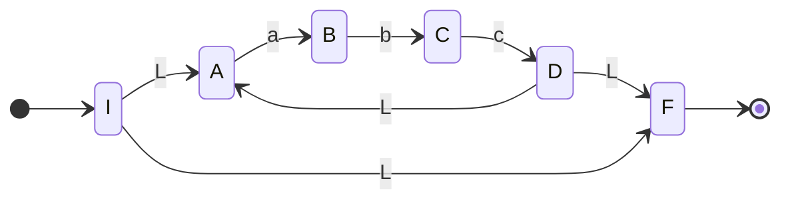
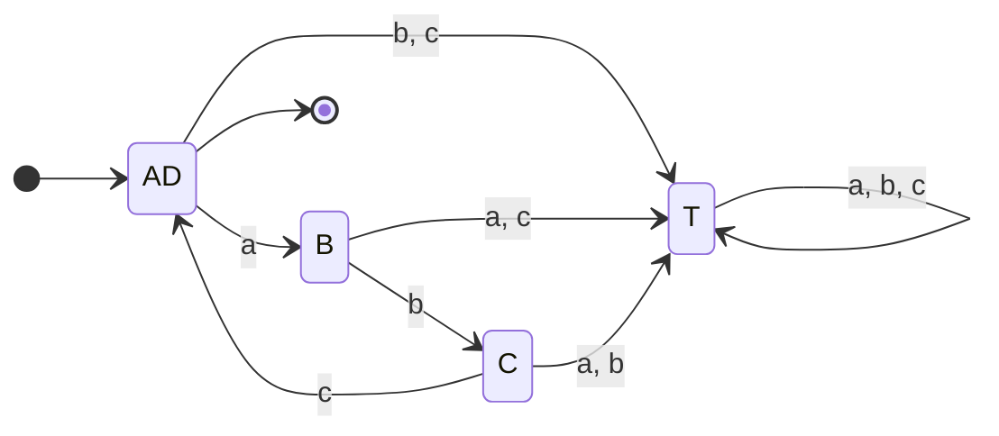
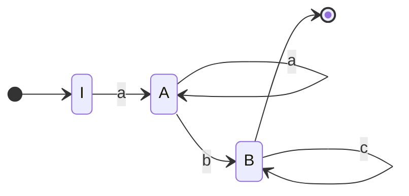

![[Tp04 Lenguajes Regulares Expresiones Regulares.pdf]]

# 1
Recordando [[Lenguaje Regular]]

## a
$$L = \{\lambda\} \Rightarrow ER = \lambda$$

## b
$$L = \{a, b\} \Rightarrow ER = a + b$$

## c
Recordar [[Lenguaje Regular#Propiedades de las ER]]
$$L =\{aa, ab, ba, bb\} \Rightarrow ER = aa+ab+ba+bb = a\cdot(a+b)+b\cdot(a+b)$$
## d
$$L =\{\lambda,aa, ab, ba, bb\} \Rightarrow ER =\lambda+ aa+ab+ba+bb = \lambda + a\cdot(a+b)+b\cdot(a+b)$$

## e 
NO REGULAR

## f
$$
L = \{a^{i}b^{j}: i, j \geq 0\} \Rightarrow ER = a^{*}\cdot b^{*}
$$
## g
NO REGULAR

## h
$$
L = \{(ab)^{i}: i \geq 0\} \Rightarrow ER = (ab)^{*}
$$
## i
$$L = \{x =\omega\omega^{r}: \omega \in \{0, 1\}^{*}, |x| \lt 5\} \Rightarrow ER = \lambda + 00+ 11+ 0000+ 1111 + 0110 + 1001$$
## j
NO REGULAR
## k
$$
L = \{a^{m}b^{n}cd^{p}:m, n, p \geq 0\} \Rightarrow ER = a^{*}b^{*}cd^{*}
$$
## l
$$
L = \{a\beta c^{n}: n \geq 0, \beta \in \{a, b\}^{+}\}\Rightarrow ER= a\cdot (a+b)^{+}c^{*}
$$
## m
$$
L = \{\omega \in \{0, 1\}^{*}: \omega~contiene~dos~unos~seguidos\} \Rightarrow ER = (1+0)^{*}11(1+0)^{*}
$$
## n
$$
L = \{\omega \in \{0, 1\}^{*}: \omega~NO~contiene~dos~unos~seguidos\} \Rightarrow ER = 0^{*}10^{*}\ldots =0^{*}(10^{+})^{*}(0^{*} + 1)
$$

# 2

## a
> Constantes reales con signo sin ceros no significativos

$$ER = (- + \lambda) \cdot (0 + (1+\ldots +9)(0+1+\ldots +9)^{*}),0^{*}(0+1+\ldots +9)^{*}(1+\ldots +9 + \lambda)$$
## b
> Constantes con notación exponencial

$$
ER = ER_a \times 10 ^{(- + \lambda) (0 | (1\ldots 9)(0\ldots 9)^{*})}
$$
## c

> Identificadores de cualquier longitud que comiencen con una letra, que contengan letras, dígitos o guiones y que no tengan dos guiones seguidos ni terminen en guión.

Sea 
$$
ER_A = (a|\ldots |z) |(A |\ldots | Z)
$$
La expresión regular que expresa cualquier letra, luego

Armamos primero la ER que sería cualquier letra o cualquier numero.

$$
ER_{AN}= (ER_A | (0 |\ldots |9))
$$
Luego:
$$
ER = 
\underbrace{(a | \ldots | z)}_{comienza~con~una~letra}
ER_{AN}^{*}
\cdot
\underbrace{
	(-  ER_{AN}^{+})^{*}
}_{letras,digitos~o~guiones}
$$

## d
> Comentarios acotados por /\*   \*/

$$
ER = /* (a | \ldots |z|A|\ldots|Z|0|\ldots|9| \_|, |.|\ldots)^{*} */
$$
## e
> Expresiones compuestas por enteros, llaves y signo de suma y resta. Por ejemplo $'1+\{2-3\}'$ o $'\{\}\{21-+'$

$$
ER = (0|\ldots | 9 | +|-|\{|\})^{*}
$$

## f
> Idem el anterior pero con llaves que balancean.

Para balancear las llaves hay que llevar un registro de cuántas llaves se abrieron, esto implica que no sea un lenguaje regular. Por ende no existe dicha expresión.

# 3
[[Lenguaje Regular#Equivalencia de ER's]]
Indicar si se cumplen las igualdades
## a
$$
R^{*} | R = R
$$
No se cumple pues digamos que $R = (ab) \Rightarrow abababababab = ab$ Absurdo.

## b
$$
R (SR)^{*} = (RS)^{*}R
$$
Veamos que la izquierda genera $R(SRSRSRSRSRSR)$ siempre terminando en R intercalando R's y S's. De la misma forma en la que lo hace el lado derecho $(RSRSRSRSRSRSRS)R$ 

## c
$$
(R^{*})^{*} = R^{*}
$$
Verdadero por propiedad 12. [[Lenguaje Regular#Propiedades de las ER]]

## d
$$
RR^{*} = R^{+}
$$
Verdadero, son equivalentes.

## e
$$
RR^{+} = R^{+}
$$
Falso pues el lado $RR \ne R$ 

# 4
Construir un AFD mínimo con 
[[Lenguaje Regular#Conversión de ER a AFD - Autómatas Finitos Deterministicos]]

## a
$$
(abc)^{*}
$$

Construyo de a poco

$$
\begin{cases}
\lambda(I) = A, F\\
\lambda(A) = A\\
\lambda(B) = B\\
\lambda(C) = C\\
\lambda(D) = D, F, A\\
\lambda(F) = F\\
\end{cases}
$$

| $\delta$ | a   | b   | c       |
| -------- | --- | --- | ------- |
| $* \rightarrow I, A, F$    | B   | T   | T       |
| B        | T   | C   | T       |
| C        | T   | T   | D, F, A |
| $* D, F, A$  | B   | T   | T       | 

AD, B, C

## b
$$
a^{+}bc^{*}
$$

| $\delta$ |     |     | 
| -------- | --- | --- |
