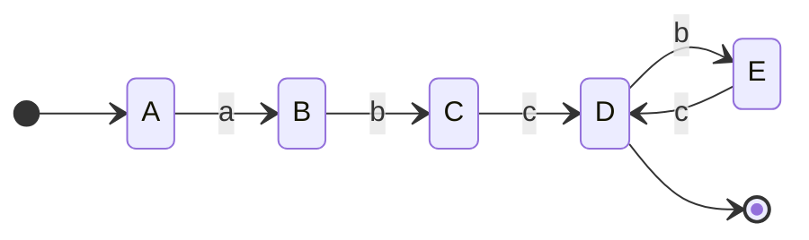
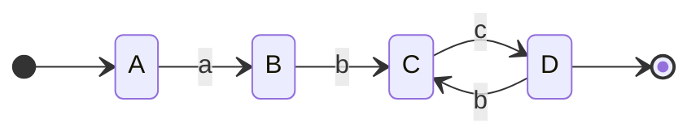

![[Tp05 Lenguajes Regulares Gramaticas 1.pdf]]

# 1

## a

$$
G = (\{S,A\}, \{0,1,2\}, S ,\{S \rightarrow 0A |2, A\rightarrow 0S|1\})
$$

Recordar que [[Gramática#Gramáticas tipo 3 Regulares]] donde hay dos tipos.
Para convertir una gramática lineal por derecha a una gramática lineal por izquierda.

$$
\begin{cases}
S \rightarrow 0A \Rightarrow \delta(S, 0) = A\\
S \rightarrow 2 \Rightarrow \delta(S, 2) = q_f\\
A \rightarrow 0S \Rightarrow \delta(A, 0) = S\\
A \rightarrow 1 \Rightarrow \delta(A, 1) = q_f\\
\end{cases}
$$
Creo la regla
$$
B \rightarrow \lambda\\
$$

y agrego la $B$ en los terminales.

$$
\hat{\delta} = \begin{cases}
S \rightarrow \lambda\\
A \rightarrow S0 \\
B \rightarrow S2 \\
S \rightarrow A0 \\
B \rightarrow A1 \\
\end{cases}
$$

$$
G = (\{S,A, B\}, \{0,1,2\}, B ,\hat{\delta})
$$

## b
$$
G = \{\{S, A, B\}, \{a, b, c\}, S, \delta\};
\delta= \begin{cases}
S \rightarrow aA|bB|cB\\
A \rightarrow aA|bA|cB\\
B \rightarrow aB|bB|\lambda
\end{cases}
$$
$$
\hat{\delta} =
\begin{cases}
S \rightarrow \lambda\\
A \rightarrow Sa| Aa|Ab\\
B \rightarrow Sb| Sc|Ac|Ba| Bb\\
\end{cases}
$$

$$
G = \{\{S, A, B\}, \{a, b, c\}, B, \hat{\delta}\}
$$

# 2
$$
L = \{a(bc)^{n} : n\geq  1\}
$$

Tengo que construir $G = <Q, \{a,b,c\}, S, P>$

Para esto puedo generar el autómata finito que genera ese lenguaje y luego convierto a gramática regular.

Minimizo

| Delta | a   | b   | c   |
| ----- | --- | --- | --- |
| A     | B   | T   | T   |
| B     | T   | C   | T   |
| C     | T   | T   | D   |
| \*D     | T   | E   | T   |
| E     | T   | T   | D   |
| T     | T   | T   | T   |

A,B,CE,T, D

convierto cada una de las transiciones obtengo el conjunto de reglas de la gramática.
$$
\begin{cases}
\delta(A, a) = B \Rightarrow A\rightarrow aB\\
\delta(B, b) = B \Rightarrow B\rightarrow bB\\
\delta(C, c) = D \Rightarrow C\rightarrow cD\\
\delta(D, b) = C \Rightarrow D\rightarrow bC\\
D \rightarrow \lambda
\end{cases}
$$

Donde queda definido
# 3

Con $\Sigma = \{a, b, c, d\}$ , construir una gramática regular que genere cadenas que no contienen la secuencia $abc$.

Complemento

# 4

## a
$$
G = <\{q_0, q_1, q_2\}, \{0, 1\}, q_0, P>
$$
$$
P = \begin{cases}
q_0 \rightarrow 0q_1 |1q_1\\
q_1 \rightarrow 0q_2 |0q_1|1q_1|\lambda\\
q_2 \rightarrow 1q_1
\end{cases}
$$
## b
$$
G = <\{q_0, q_1, q_2\}, \{0, 1\}, q_0, P>
$$
$$
P = \begin{cases}
q_0 \rightarrow 0q_0 | 0q_1|1q_1\\
q_1 \rightarrow 0q_2 |1q_2|\lambda\\
q_2 \rightarrow 1q_1
\end{cases}
$$

## c
$$
G = <\{q_0, q_1, q_2,3\}, \{0, 1\}, q_0, P>
$$
Aca obviamente es más facil con el minimizado.

$$
P \rightarrow \begin{cases}
A \rightarrow 1B \\
B \rightarrow  0A| 1B|\lambda
\end{cases}
$$
# 5
