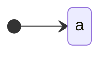

![[1Q2017 - PARCIAL-1.pdf]]

# 1
## a

$$
Demostrar ~~~(\alpha^{r})^{n} = (\alpha^{n})^{r}
$$
- Caso base: $n= 0 : (\alpha^{r})^{0} = (\alpha^{0})^{r}$ 
	- $(\alpha^{r})^{0} = \lambda$
	- $(\alpha^{0})^{r} = \lambda$
- HI: $(\alpha^{r})^{n} = (\alpha^{n})^{r}$
- Tesis: $(\alpha^{r})^{n+1} = (\alpha^{n+1})^{r}$

$$(\alpha^{r})^{n+1} = (\alpha^{r})^{n}(\alpha^{r})$$

Luego por HI:

$$(\alpha^{r})^{n+1} = (\alpha^{n})^{r}(\alpha^{r}) = (a^{n+1})^{r}$$
Que es lo mismo que 

$$(\alpha^{n+1})^{r} = (\alpha^{n}\alpha)^{r} = (\alpha^{r})(\alpha^{n})^{r} = (\alpha^{r})^{n+1}$$
## b
Sea
$$
Demostrar ~~P_1 \subset L_1 = \{\omega \in \{a, b\}^{*} : \omega = (ab)^{n}, n \geq 0\}
$$

Esto significa que tenemos que demostrar $\forall p \in P_1 \Rightarrow p \in L_1$

- Base
	- $\lambda \in P_1 \Rightarrow \omega =(ab)^{0} = \lambda \in L_1$
- Paso inductivo
	- sea $x\in P_1 \Rightarrow x\in L_1$
	- Sea $\omega = a(bx)^{r} \in P_1$
		- Veamos que por propiedad del reverso $\omega = a(x)^{r}b \in L_1$
		- como $x\in L_1$ entonces $\omega$ es de la forma $a((ab)^{n})^{r}b$ con $n\geq 0$
		- que por el ejercicio anterior es lo mismo que $a(ba)^{n}b$
		- De forma indiferente del valor de n, siempre nos va a quedar que $\omega \in L_1$
	- Sea $\omega = xx \in P_1$
		- $x = (ab)^{n} \Rightarrow xx = (ab)^{n}(ab)^{n} = (ab)^{2n} \in L_1$

Se concluye que $\forall p \in P_1 \Rightarrow p \in L_1 \therefore P_1 \subset L_1$

# 2

Armar AFD mínimo de 
$$
L_2 = \{\omega \in \{0, 1, 2\}^{*}: \omega ~No~tiene~01~ni~12\}
$$
Aplico el truquito crear el autómata que contenga el 01 y 12,  luego consigo el complemento.

