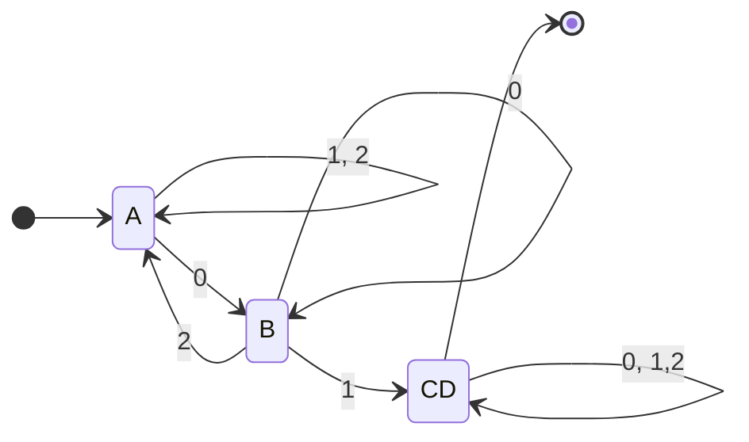
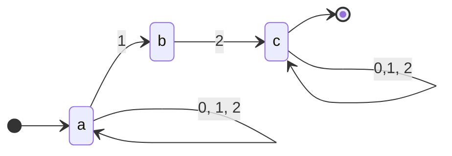
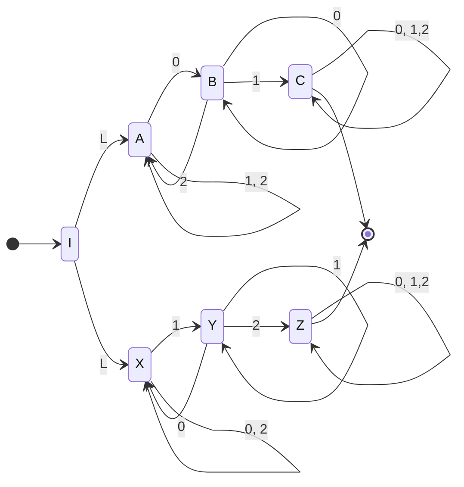
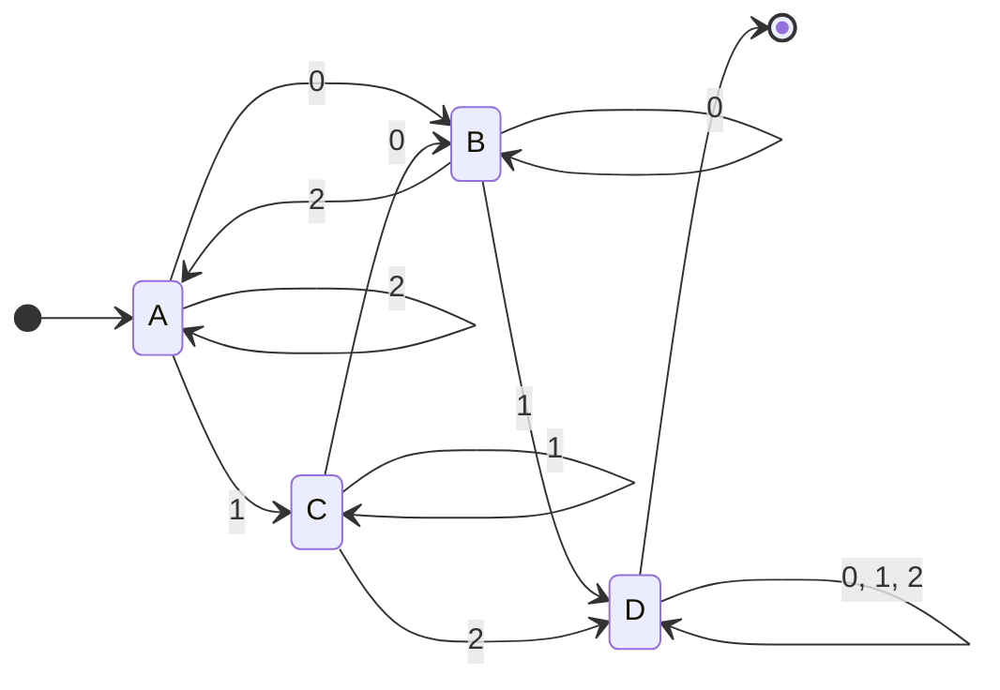
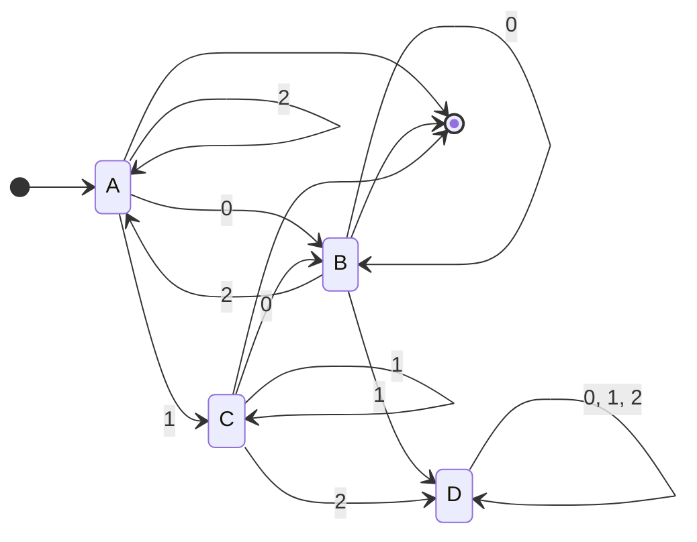
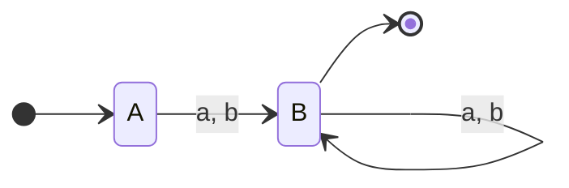

![[1Q2017 - PARCIAL-1.pdf]]

# 1
## a

$$
Demostrar ~~~(\alpha^{r})^{n} = (\alpha^{n})^{r}
$$
- Caso base: $n= 0 : (\alpha^{r})^{0} = (\alpha^{0})^{r}$ 
	- $(\alpha^{r})^{0} = \lambda$
	- $(\alpha^{0})^{r} = \lambda$
- HI: $(\alpha^{r})^{n} = (\alpha^{n})^{r}$
- Tesis: $(\alpha^{r})^{n+1} = (\alpha^{n+1})^{r}$

$$(\alpha^{r})^{n+1} = (\alpha^{r})^{n}(\alpha^{r})$$

Luego por HI:

$$(\alpha^{r})^{n+1} = (\alpha^{n})^{r}(\alpha^{r}) = (a^{n+1})^{r}$$
Que es lo mismo que 

$$(\alpha^{n+1})^{r} = (\alpha^{n}\alpha)^{r} = (\alpha^{r})(\alpha^{n})^{r} = (\alpha^{r})^{n+1}$$
## b
Sea
$$
Demostrar ~~P_1 \subset L_1 = \{\omega \in \{a, b\}^{*} : \omega = (ab)^{n}, n \geq 0\}
$$

Esto significa que tenemos que demostrar $\forall p \in P_1 \Rightarrow p \in L_1$

- Base
	- $\lambda \in P_1 \Rightarrow \omega =(ab)^{0} = \lambda \in L_1$
- Paso inductivo
	- sea $x\in P_1 \Rightarrow x\in L_1$
	- Sea $\omega = a(bx)^{r} \in P_1$
		- Veamos que por propiedad del reverso $\omega = a(x)^{r}b \in L_1$
		- como $x\in L_1$ entonces $\omega$ es de la forma $a((ab)^{n})^{r}b$ con $n\geq 0$
		- que por el ejercicio anterior es lo mismo que $a(ba)^{n}b$
		- De forma indiferente del valor de n, siempre nos va a quedar que $\omega \in L_1$
	- Sea $\omega = xx \in P_1$
		- $x = (ab)^{n} \Rightarrow xx = (ab)^{n}(ab)^{n} = (ab)^{2n} \in L_1$

Se concluye que $\forall p \in P_1 \Rightarrow p \in L_1 \therefore P_1 \subset L_1$

# 2

Armar AFD mínimo de 
$$
L_2 = \{\omega \in \{0, 1, 2\}^{*}: \omega ~No~tiene~01~ni~12\}
$$
Aplico el truquito crear el autómata que contenga el 01 y 12,  luego consigo el complemento. Para esto tiene sentido primero hacer individualmente los dos autómatas 01 y 12 por separado y luego aplicar la unión.

> Autómata que contiene 01

| DELTA | 0   | 1   | 2   |
| ----- | --- | --- | --- |
| a     | ab  | a   | a   |
| ab    | ab  | ac  | a   |
| \*ac    | abc | ac  | ac  |
| \*abc   | abc | ac  | ac  |

A,B, CD

> Autómata que contiene 12

Que muy parecido al anterior nos queda

Ahora hacemos una unión de ambos autómatas para conseguir el autómata que contiene ambos, 01 y 12.

|     | DELTA | 0   | 1   | 2   |
| --- | ----- | --- | --- | --- |
| ->A    | AX    | BX  | AY  | AX  |
| B    | BX    | BX  | CY  | AX  |
| C    | AY    | BX  | AY  | AZ  |
| D    | \*CY  | CX  | CY  | CZ  |
| E   | \*AZ  | BZ  | AZ  | AZ  |
| F    | \*CX  | CX  | CY  | CX  |
| G    | \*CZ  | CZ  | CZ  | CZ  |
| H    | \*BZ  | BZ  | CZ  | AZ  |

Aca puedo minimizarlo o no, hagamoslo a ojo

A,B,C, DEFGH

Con esto obtenemos

| DELTA | 0   | 1   | 2   |
| ----- | --- | --- | --- |
| ->A     | B   | C   | A   |
| B     | B   | D   | A   |
| C     | B   | C   | D   |
| \*D     | D   | D   | D   | 

Finalmente para obtener el complemento de este autómata, tenemos que invertir los estados terminales a no terminales y viceversa.
$$
AFD = <\{0,1,2\}, \{A,B,C,D\}, \delta, A, \{D\}>
$$
a
$$
AFD = <\{0,1,2\}, \{A,B,C,D\}, \delta, A, \{A,B,C\}>
$$

Fijese que si en cualquier momento se intenta obtener 01 o 12, esto no sería posible pues ambos van a un estado que en este momento se convirtió en trampa.

# 3
Basicamente pasar de $AFND-\lambda$  a RegEx mediante el método de ecuaciones características.

Primero paso a una tabla sin lambda porque así es muy molesto.

|     | Delta  | a    | b   |
| --- | ------ | ---- | --- |
| A   | P      | PQS  | QS  |
| B   | \*PQS  | PQRS | QRS |
| C   | \*QS   | QRS   | QRS |
| D   | \*QRS  | QRS   | QRS |
| E   | \*PQRS | PQRS | QRS |

A, BCDE

Luego tenemos 

| Delta | a   | b   |
| ----- | --- | --- |
| ->A   | B   | B   |
| \*B     | B   | B   |

Hacemos las ecuaciones características

$$
\begin{cases}
 A= aB+bB\\
 B= aB+bB + \lambda\\
\end{cases}
$$
Aplicamos lema de Arden donde podamos
$$
B= (a + b)B+\lambda = (a+b)^{*}
$$

$$A = (a +  b)(a+b)^{*}$$
# 4
