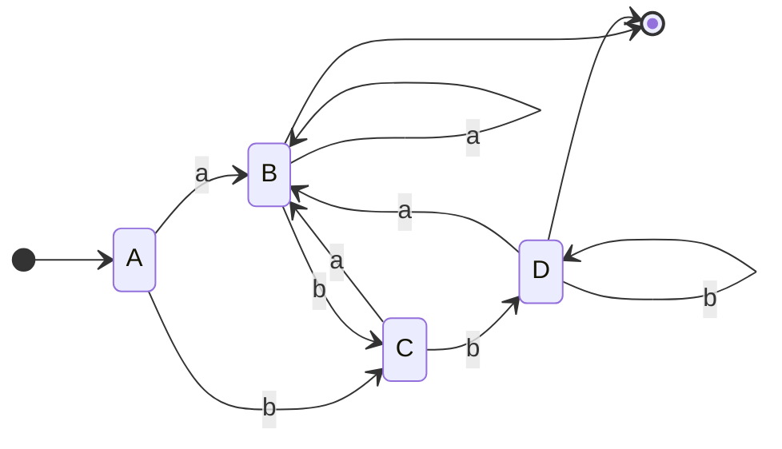
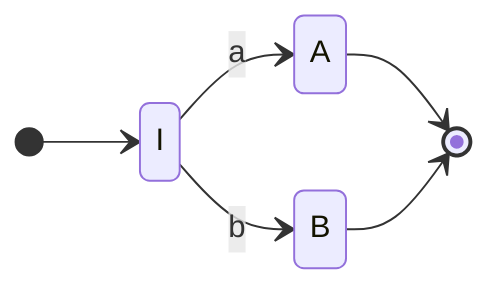
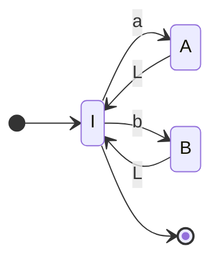
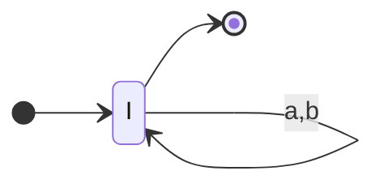
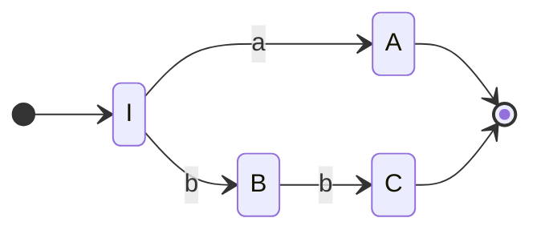
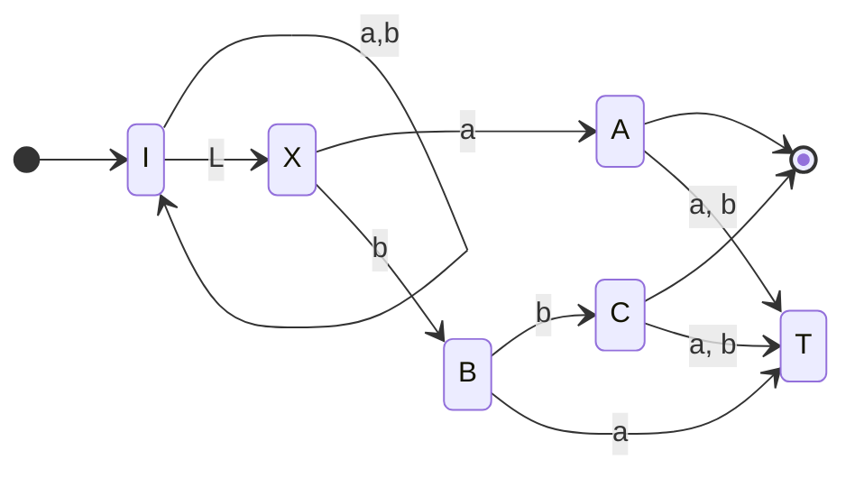
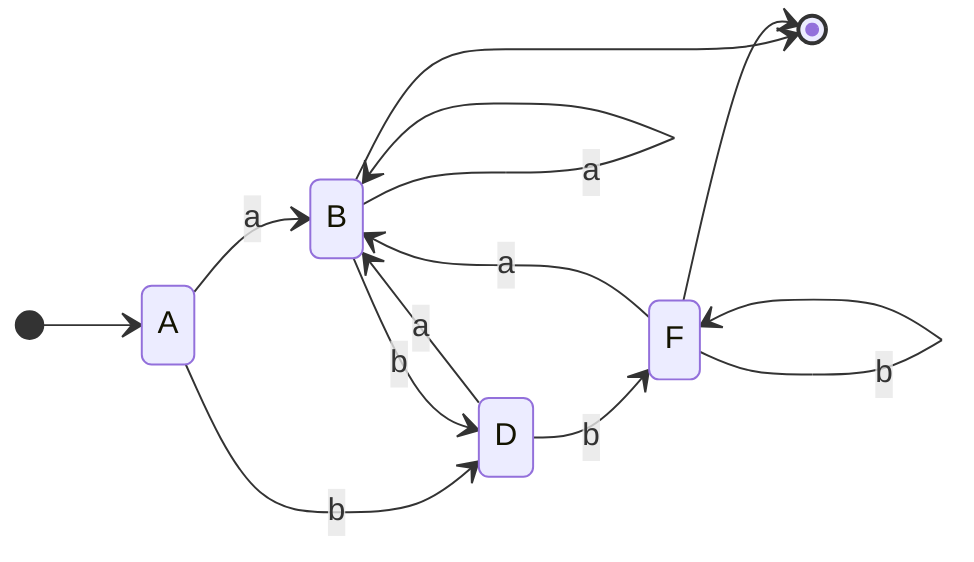

![[2Q2016 - Parcial-1.pdf]]

#  1
# b

$$
P_1 \subset L_1 = \{\omega \in \{a, b\}^{*}: \omega = (ab)^{n}, n\geq 0\}
$$

$$
\forall p \in P_1 \Rightarrow p \in L_1
$$
- Caso base
	- $p= \lambda \Rightarrow p \in L_1$
- Paso inductivo
	- Sea $p = ax^{r}bx \in P_1$
	- Sabemos que $x\in L_1 \Rightarrow x =(ab)^{n} , n\geq 0$
	- luego $p= a ((ab)^{n})^{r}b(ab)^{n}$
	- por propiedad $((ab)^{n})^{r} = (ba)^{n}$
		- CB: $\lambda = \lambda$
		- HI: $((ab)^{n})^{r} = (ba)^{n}$
		- T: $((ab)^{n+1})^{r} = (ba)^{n+1} =(ba)^{n}(ba)$
		- $((ab)^{n}(ab))^{r} = (ba)((ab)^{n})^r$
		- por HI entonces $(ba)(ba)^{n}$ que es igual que $(ba)^{n}(ba)$
	- Entonces tenemos hasta ahora $a(ba)^{n}b(ab)^{n}$
	- Veamos que $a(ba)^{n}b(ab)^{n} \subset (ab)^{n}, n\geq 1$
		- CB : $ab = ab$
		- HI : $a(ba)^{h}b(ab)^{h} \subset (ab)^{n}, n\geq h$
		- T: $a(ba)^{h+1}b(ab)^{h+1} \subset (ab)^{h+1}, n\geq h$
		- $a (ba)(ba)^{h}b(ab)(ab)^{h} = (ab)^{n}$
		- $aba(ba)^{h}bab(ab)^{h} \subset ab^{n}$
- Luego queda demostrado que  $p = ax^{r}bx \in P_1: x\in P_1 \Rightarrow x \in L_1 \Rightarrow p \in L_1$

# 3
> Demostrar de dos maneras distintas que $L(A) =L(R)$
$$
R = (b^{*}a)^{*}b^{*}(a+bb)
$$

Dos maneras de hacer esto son:
1. Crear el AFD-mínimo, de ambos autómatas y observar que son el mismo
2. Reducir el autómata $A$ a una expresión regular.

## 1

Primero hacemos la tabla de transiciones $\delta$ sin las transiciones $\lambda$

|     | Delta  | a   | b    |
| --- | ------ | --- | ---- |
| A    | PQ     | PQR | PQS  |
| B    | \*PQR  | PQR | PQS  |
| C    | PQS    | PQR | PQRS |
| D    | \*PQRS | PQR | PQRS |

Luego minimizo
A, C, B,D (ya minimizado)

Veamos que ahora la expresión regular $R$ es equivalente en las palabras que produce.

veamos que por propiedad
$$
R = (b+a)^{*}(a+bb)
$$
Luego genero los autómatas básicos

$b+a$

$(b+a)^{*}$

Minimizo

| Delta | a   | b   |
| ----- | --- | --- |
| ->\*I   | AI  | BI  |
| \*AI    | AI  | BI   |
| \*BI    | AI   | BI  |

Luego 
$(a+b)^{*}$

$a+bb$

Ahora aplicamos la concatenación de $(a+b)^{*}$ con $(a+bb)$

finalmente minimizo

|     | Delta  | a    | b    |
| --- | ------ | ---- | ---- |
| A   | IX     | IA   | IB   |
| B   | \*IA   | IA   | IB   |
| D   | IB     | IA   | IBC  |
| F   | \*IBC  | IA   | IBC  | 

Luego

Que es el mismo autómata que el producido por la tabla.
# 2
reducimos el autómata a la expresión regular

$$
\begin{cases}
A = aB +bC\\
B = aB +bC + \lambda\\
C = aB +bD\\
D = aB +bD + \lambda\\
\end{cases}
$$

Por Arden sabemos que 
d --> b -->c

$$
\begin{cases}
B = a^{*}(bC +\lambda) = a^{*}bC + a^{*}\\
D = b^{*}(aB +\lambda) = b^{*}aB + b^{*} 
\end{cases}
$$
$$
B = a^{*}b (aB +bD)+a^{*} = a^{*}b aB +a^{*}b bD+a^{*} = (a^{*}b a)^{*}(a^{*}b bD+a^{*})
$$
$$
B = (a^{*}b a)^{*}a^{*}b bD+(a^{*}b a)^{*}a^{*}
$$

$$
D =  b^{*}a(a^{*}b a)^{*}a^{*}b bD+(a^{*}b a)^{*}a^{*} +b^{*}
$$

$$
D =  (b^{*}a(a^{*}b a)^{*}a^{*}b b)^{*}((a^{*}b a)^{*}a^{*} +b^{*})
$$
$$
D =  (b^{*}aa^{*}b (aa^{*}b)^{*} b)^{*}((a^{*}b a)^{*}a^{*} +b^{*})
$$
